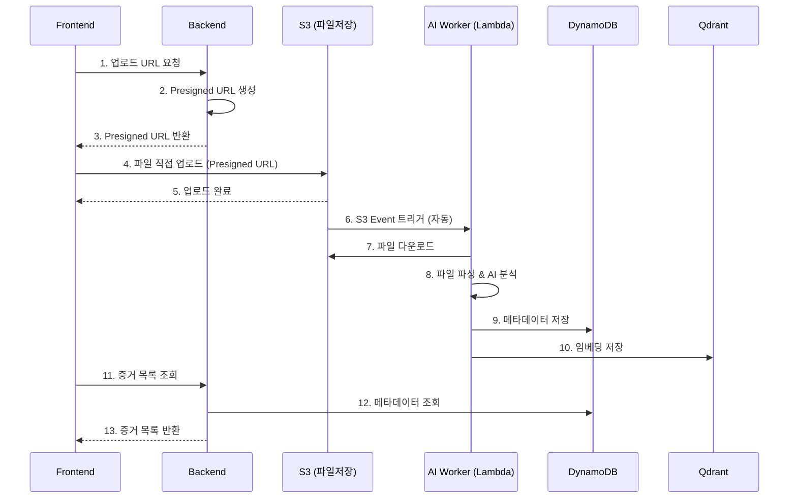
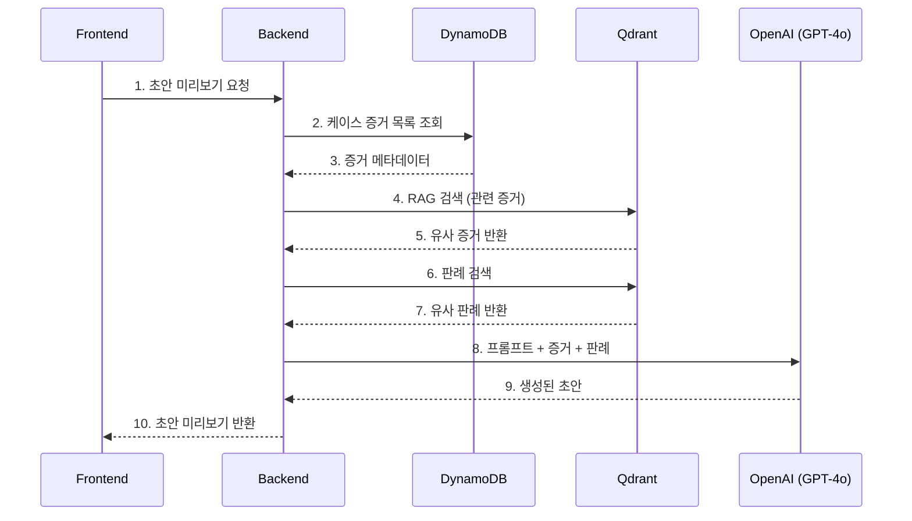
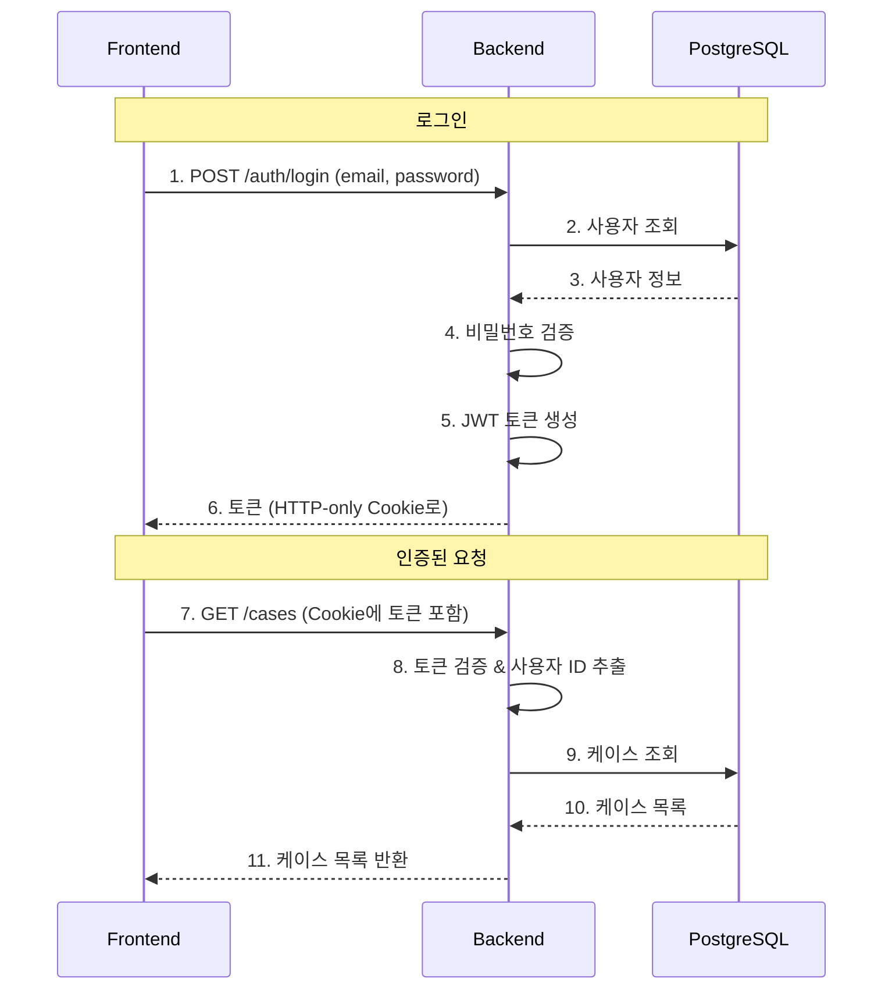

# 04. 데이터 흐름

> **목표**: 증거 업로드부터 초안 생성까지 데이터가 어떻게 흘러가는지 이해합니다.

---

## 주요 데이터 흐름

CHAGOK에서 가장 중요한 3가지 데이터 흐름을 살펴봅니다:

1. **증거 업로드 파이프라인** - 파일 업로드 → AI 분석 → 저장
2. **초안 생성 흐름** - RAG 검색 → AI 생성 → 미리보기
3. **인증 흐름** - 로그인 → 토큰 발급 → 권한 체크

---

## 1. 증거 업로드 파이프라인

### 전체 흐름도



### 단계별 상세 설명

#### Step 1-3: Presigned URL 요청

**왜 Presigned URL을 쓰나요?**

```
[일반적인 방식 - 문제 있음]
Frontend → Backend → S3
         (파일 전달)

문제:
- 대용량 파일이 Backend를 거쳐감 → 느림
- Backend 메모리 부담 → 비용 증가
- Lambda 타임아웃 위험 (최대 15분)
```

```
[Presigned URL 방식 - CHAGOK이 사용]
Frontend → S3 (직접 업로드)
Backend는 URL만 발급

장점:
- 대용량 파일도 빠르게 업로드
- Backend 부하 없음
- 보안 유지 (URL 5분 후 만료)
```

**코드 예시**:

```python
# backend/app/utils/s3.py

def generate_presigned_upload_url(
    bucket: str,
    key: str,                    # S3 저장 경로
    content_type: str,           # 파일 타입 (image/jpeg 등)
    expires_in: int = 300        # 5분 후 만료
) -> dict:
    """
    S3에 직접 업로드할 수 있는 임시 URL 생성
    """
    s3_client = boto3.client('s3')

    url = s3_client.generate_presigned_url(
        'put_object',
        Params={
            'Bucket': bucket,
            'Key': key,
            'ContentType': content_type
        },
        ExpiresIn=expires_in
    )

    return {"upload_url": url, "key": key}
```

```typescript
// frontend에서 사용
const uploadFile = async (file: File, caseId: string) => {
  // 1. Backend에서 Presigned URL 받기
  const { upload_url, key } = await api.post('/evidence/upload-url', {
    case_id: caseId,
    filename: file.name,
    content_type: file.type
  });

  // 2. S3에 직접 업로드
  await fetch(upload_url, {
    method: 'PUT',
    body: file,
    headers: { 'Content-Type': file.type }
  });
};
```

#### Step 6-10: AI Worker 처리

**S3 Event가 뭔가요?**

S3 버킷에 파일이 업로드되면 자동으로 Lambda를 실행시키는 기능입니다.

```
S3 버킷 설정:
- 이벤트 타입: s3:ObjectCreated:*
- 필터: cases/*/raw/*
- 대상: leh-ai-worker Lambda

→ cases/123/raw/photo.jpg 업로드되면
→ AI Worker Lambda 자동 실행
```

**AI Worker 처리 코드**:

```python
# ai_worker/handler.py

def handler(event, context):
    """
    Lambda 진입점 - S3 이벤트 처리
    """
    # S3 이벤트에서 정보 추출
    record = event['Records'][0]
    bucket = record['s3']['bucket']['name']
    key = record['s3']['object']['key']  # "cases/123/raw/photo.jpg"

    # 케이스 ID 추출
    case_id = key.split('/')[1]  # "123"

    # 파일 다운로드
    local_path = download_from_s3(bucket, key)

    # 파일 타입에 따라 파서 선택
    parser = route_parser(key)  # 확장자로 판단

    # 파싱 (OCR, STT 등)
    parsed_messages = parser.parse(local_path)

    # AI 분석
    analysis = analyze_evidence(parsed_messages)

    # DynamoDB에 메타데이터 저장
    save_to_dynamodb(case_id, analysis)

    # Qdrant에 임베딩 저장 (RAG용)
    save_to_qdrant(case_id, parsed_messages)

    return {"status": "success"}

def route_parser(key: str):
    """
    파일 확장자에 따라 적절한 파서 선택
    """
    ext = key.split('.')[-1].lower()

    parsers = {
        'jpg': ImageVisionParser,
        'png': ImageVisionParser,
        'pdf': PDFParser,
        'mp3': AudioParser,
        'wav': AudioParser,
        'mp4': VideoParser,
        'txt': TextParser,
    }

    return parsers.get(ext, TextParser)()
```

---

## 2. 초안 생성 흐름 (RAG)

### RAG란?

**RAG (Retrieval-Augmented Generation)**는 검색 결과를 활용해 AI 응답을 생성하는 기법입니다.

```
[일반 AI]
질문 → AI → 답변 (AI가 학습한 내용만 사용)

[RAG]
질문 → 검색 → 관련 문서 찾기 → AI + 검색 결과 → 답변
                  ↑
            우리 데이터에서!
```

**CHAGOK에서 RAG가 필요한 이유**:
- AI는 우리 케이스의 증거를 모름
- 검색으로 관련 증거를 찾아서 AI에게 전달
- AI가 증거를 참고해서 초안 작성

### 전체 흐름도



### 단계별 상세 설명

#### Step 4-5: RAG 검색

**임베딩(Embedding)이란?**

텍스트를 숫자 벡터로 변환한 것입니다. 비슷한 의미의 텍스트는 비슷한 벡터를 가집니다.

```
"남편이 폭언했다" → [0.1, 0.8, 0.3, ...]
"배우자가 욕했다" → [0.15, 0.75, 0.28, ...]  ← 비슷한 벡터!
"오늘 날씨 좋다" → [0.9, 0.1, 0.5, ...]      ← 다른 벡터
```

**Qdrant 검색 코드**:

```python
# backend/app/utils/qdrant.py

def search_evidence_by_semantic(
    case_id: str,
    query: str,
    top_k: int = 5
) -> list[dict]:
    """
    의미적으로 유사한 증거 검색

    예: query="폭언" → 욕설, 폭력적 언어 관련 증거 반환
    """
    # 1. 쿼리를 임베딩 벡터로 변환
    query_embedding = get_embedding(query)

    # 2. Qdrant에서 유사 벡터 검색
    collection_name = f"case_rag_{case_id}"

    results = qdrant_client.search(
        collection_name=collection_name,
        query_vector=query_embedding,
        limit=top_k
    )

    # 3. 결과 반환
    return [
        {
            "evidence_id": r.payload["evidence_id"],
            "content": r.payload["content"],
            "score": r.score  # 유사도 점수
        }
        for r in results
    ]
```

#### Step 8-9: AI 초안 생성

```python
# backend/app/services/draft_service.py

def generate_draft_preview(
    case_id: str,
    draft_type: str  # "소장", "준비서면" 등
) -> DraftPreview:
    """
    초안 미리보기 생성
    """
    # 1. 케이스 정보 조회
    case_info = get_case_info(case_id)

    # 2. RAG: 관련 증거 검색
    relevant_evidence = search_evidence_by_semantic(
        case_id=case_id,
        query=f"{draft_type} 작성에 필요한 증거"
    )

    # 3. 유사 판례 검색
    similar_precedents = search_precedents(
        query=case_info.case_type
    )

    # 4. 프롬프트 구성
    prompt = f"""
    다음 정보를 바탕으로 {draft_type} 초안을 작성하세요.

    [케이스 정보]
    {case_info}

    [관련 증거]
    {format_evidence(relevant_evidence)}

    [참고 판례]
    {format_precedents(similar_precedents)}

    주의사항:
    - 증거를 인용할 때 출처를 명시하세요
    - 법률 용어를 정확하게 사용하세요
    """

    # 5. GPT-4o 호출
    response = openai_client.chat.completions.create(
        model="gpt-4o",
        messages=[
            {"role": "system", "content": "당신은 이혼 소송 전문 변호사입니다."},
            {"role": "user", "content": prompt}
        ]
    )

    # 6. 결과 반환 (미리보기만! 자동 제출 안 함)
    return DraftPreview(
        content=response.choices[0].message.content,
        evidence_citations=relevant_evidence,
        precedent_citations=similar_precedents,
        status="preview"  # 중요: 미리보기 상태
    )
```

**중요**: `status="preview"` - 변호사가 검토/수정 후 수동으로 제출해야 합니다.

---

## 3. 인증 흐름

### JWT 기반 인증



### JWT 토큰 구조

```
eyJhbGciOiJIUzI1NiIsInR5cCI6IkpXVCJ9.
eyJzdWIiOiJ1c2VyXzEyMyIsInJvbGUiOiJsYXd5ZXIiLCJleHAiOjE3MDQ0MjAwMDB9.
SflKxwRJSMeKKF2QT4fwpMeJf36POk6yJV_adQssw5c

[헤더].[페이로드].[서명]
```

**페이로드 (Payload)**:
```json
{
  "sub": "user_123",       // 사용자 ID
  "role": "lawyer",        // 역할
  "email": "kim@law.com",  // 이메일
  "exp": 1704420000        // 만료 시간
}
```

---

## 데이터 저장소 정리

### 어디에 뭘 저장하나요?

| 저장소 | 용도 | 저장 데이터 |
|--------|------|------------|
| **PostgreSQL (RDS)** | 정형 데이터, 트랜잭션 | 사용자, 케이스, 멤버, 초안, 감사로그 |
| **DynamoDB** | 증거 메타데이터 | 증거 정보, 라벨, 요약, 타임스탬프 |
| **Qdrant** | 벡터 검색 | 증거 임베딩, 판례 임베딩 |
| **S3** | 파일 저장 | 증거 원본 파일 (이미지, 오디오, PDF 등) |

### 케이스 격리

**각 케이스는 완전히 격리됩니다**:

```
케이스 A의 데이터:
├── PostgreSQL: case_id = "case_A"
├── DynamoDB: case_id = "case_A" (파티션 키)
├── Qdrant: collection = "case_rag_case_A"
└── S3: s3://bucket/cases/case_A/raw/*

케이스 B의 데이터:
├── PostgreSQL: case_id = "case_B"
├── DynamoDB: case_id = "case_B" (파티션 키)
├── Qdrant: collection = "case_rag_case_B"  ← 별도 컬렉션!
└── S3: s3://bucket/cases/case_B/raw/*
```

**왜 격리하나요?**
- 보안: 다른 케이스 데이터 접근 방지
- 성능: 케이스별 검색 속도 향상
- 삭제: 케이스 종료 시 깔끔하게 삭제 가능

---

## 요약: 데이터 흐름 한눈에 보기

```
┌─────────────────────────────────────────────────────────────────┐
│                         Frontend                                 │
│                                                                  │
│  ① 파일 선택 → ② Presigned URL 요청 → ③ S3 직접 업로드          │
│  ⑪ 증거 목록 표시 ← ⑩ API 응답                                   │
└─────────────────────────────────────────────────────────────────┘
                              │
                              ▼
┌─────────────────────────────────────────────────────────────────┐
│                         Backend                                  │
│                                                                  │
│  ④ Presigned URL 생성                                           │
│  ⑨ DynamoDB 조회 → 데이터 가공                                   │
└─────────────────────────────────────────────────────────────────┘
                              │
              ┌───────────────┼───────────────┐
              ▼               ▼               ▼
┌──────────────────┐ ┌──────────────┐ ┌──────────────┐
│        S3        │ │   DynamoDB   │ │    Qdrant    │
│                  │ │              │ │              │
│ ⑤ 파일 저장      │ │ ⑧ 메타 저장  │ │ ⑧ 임베딩저장 │
└──────────────────┘ └──────────────┘ └──────────────┘
         │
         │ S3 Event
         ▼
┌─────────────────────────────────────────────────────────────────┐
│                        AI Worker                                 │
│                                                                  │
│  ⑥ 파일 다운로드 → ⑦ AI 분석 (OCR/STT/Vision)                   │
│  ⑧ 분석 결과 저장 (DynamoDB + Qdrant)                            │
└─────────────────────────────────────────────────────────────────┘
```

---

**다음 문서**: [05. CI/CD 파이프라인](05-CICD_PIPELINE.md) - 코드가 자동으로 테스트되고 배포되는 과정을 알아봅니다.
