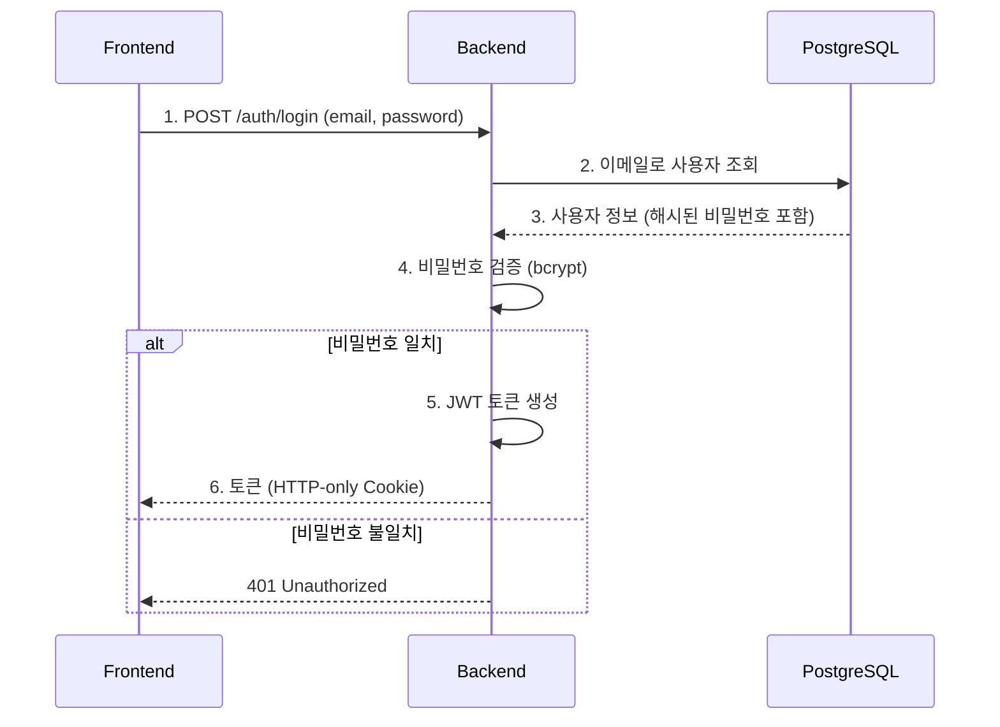

# 06. 보안 및 인증

> **목표**: JWT 인증 방식과 역할 기반 권한 시스템을 이해합니다.

---

## 인증 vs 인가

### 인증 (Authentication)

**"당신이 누구인가?"** - 신원 확인

```
비유: 호텔 체크인
- 신분증 확인 → 예약자 본인 맞음
- 키카드 발급 → 객실 입장 가능
```

### 인가 (Authorization)

**"당신이 무엇을 할 수 있는가?"** - 권한 확인

```
비유: 호텔 키카드
- 일반 키카드: 본인 객실만 입장 가능
- 마스터 키카드: 모든 객실 입장 가능
- 직원 키카드: 청소용 객실만 입장 가능
```

---

## CHAGOK의 인증 시스템

### JWT (JSON Web Token) 방식

**JWT란?**

사용자 정보를 담은 암호화된 토큰입니다.

```
eyJhbGciOiJIUzI1NiIsInR5cCI6IkpXVCJ9.
eyJzdWIiOiJ1c2VyXzEyMyIsInJvbGUiOiJsYXd5ZXIiLCJleHAiOjE3MDQ0MjAwMDB9.
SflKxwRJSMeKKF2QT4fwpMeJf36POk6yJV_adQssw5c

[헤더].[페이로드].[서명]
```

**구조**:

| 부분 | 내용 | 예시 |
|------|------|------|
| **헤더** | 알고리즘 정보 | `{"alg": "HS256", "typ": "JWT"}` |
| **페이로드** | 사용자 정보 | `{"sub": "user_123", "role": "lawyer"}` |
| **서명** | 위변조 방지 | `HMACSHA256(...)` |

### 왜 JWT를 쓰나요?

**세션 방식 (전통적)**:
```
1. 로그인 → 서버가 세션 ID 생성 → 서버 메모리에 저장
2. 요청마다 세션 ID 전송 → 서버가 메모리에서 조회

문제점:
- 서버가 여러 대면? 세션 공유 필요 (Redis 등)
- 서버가 상태를 저장해야 함 (Stateful)
- Lambda는 상태 저장 불가!
```

**JWT 방식 (CHAGOK 사용)**:
```
1. 로그인 → 서버가 JWT 생성 → 클라이언트에 전달
2. 요청마다 JWT 전송 → 서버가 서명 검증만 (DB 조회 불필요)

장점:
- 서버가 상태를 저장 안 함 (Stateless)
- Lambda에 적합!
- 확장성 좋음
```

---

## 로그인 흐름

### 전체 흐름도



### 코드 상세

#### 1. 비밀번호 해싱

```python
# backend/app/core/security.py

from passlib.context import CryptContext

pwd_context = CryptContext(schemes=["bcrypt"], deprecated="auto")

def hash_password(password: str) -> str:
    """
    비밀번호를 bcrypt로 해싱

    예: "mypassword123" → "$2b$12$LQv3c1yqBWV..."

    bcrypt 특징:
    - 단방향 해시 (복호화 불가)
    - 솔트 자동 생성 (같은 비밀번호도 다른 해시)
    - 느림 (브루트포스 공격 방지)
    """
    return pwd_context.hash(password)

def verify_password(plain_password: str, hashed_password: str) -> bool:
    """
    입력된 비밀번호와 저장된 해시 비교

    작동 방식:
    1. 입력 비밀번호를 같은 솔트로 해싱
    2. 결과와 저장된 해시 비교
    """
    return pwd_context.verify(plain_password, hashed_password)
```

#### 2. JWT 토큰 생성

```python
# backend/app/core/security.py

from jose import jwt
from datetime import datetime, timedelta, timezone

def create_access_token(data: dict) -> str:
    """
    JWT Access Token 생성

    data 예시: {"sub": "user_123", "role": "lawyer", "email": "kim@law.com"}
    """
    to_encode = data.copy()

    # 만료 시간 설정 (기본 60분)
    expire = datetime.now(timezone.utc) + timedelta(
        minutes=settings.JWT_ACCESS_TOKEN_EXPIRE_MINUTES
    )
    to_encode.update({"exp": expire})

    # JWT 생성
    encoded_jwt = jwt.encode(
        to_encode,
        settings.JWT_SECRET,        # 비밀 키
        algorithm=settings.JWT_ALGORITHM  # HS256
    )

    return encoded_jwt
```

**생성된 토큰 페이로드**:
```json
{
  "sub": "user_123",        // 사용자 ID
  "role": "lawyer",         // 역할
  "email": "kim@law.com",   // 이메일
  "exp": 1704420000         // 만료 시간 (Unix timestamp)
}
```

#### 3. HTTP-only Cookie 설정

```python
# backend/app/api/auth.py

@router.post("/login")
def login(credentials: LoginRequest, response: Response):
    # ... 인증 로직 ...

    # Cookie로 토큰 전달
    response.set_cookie(
        key="access_token",
        value=access_token,
        httponly=True,      # JavaScript에서 접근 불가 (XSS 방지)
        secure=True,        # HTTPS에서만 전송
        samesite="none",    # Cross-origin 요청 허용
        max_age=3600,       # 1시간
        path="/"
    )

    return {"message": "Login successful"}
```

**왜 HTTP-only Cookie?**

```
[localStorage에 저장하면?]
- JavaScript로 접근 가능: localStorage.getItem("token")
- XSS 공격에 취약! 악성 스크립트가 토큰 탈취 가능

[HTTP-only Cookie면?]
- JavaScript로 접근 불가
- 브라우저가 자동으로 요청에 포함
- XSS 공격으로 토큰 탈취 불가
```

---

## 인증된 요청 처리

### 토큰 검증 흐름

```
요청 헤더: Authorization: Bearer eyJhbG...
또는
요청 쿠키: access_token=eyJhbG...
           │
           ▼
┌─────────────────────────────────────────┐
│        get_current_user_id()            │
│                                         │
│  1. 토큰 추출 (헤더 또는 쿠키)          │
│  2. 토큰 디코딩                         │
│  3. 서명 검증 (JWT_SECRET으로)          │
│  4. 만료 시간 확인                      │
│  5. user_id 반환                        │
└─────────────────────────────────────────┘
           │
           ▼
     user_id 사용 가능
```

### 코드 상세

```python
# backend/app/core/dependencies.py

from fastapi import Depends, Header, Cookie, HTTPException

def get_current_user_id(
    authorization: str | None = Header(None),
    access_token: str | None = Cookie(None)
) -> str:
    """
    요청에서 JWT를 추출하고 검증하여 user_id 반환

    토큰 위치 우선순위:
    1. Authorization 헤더 (API 클라이언트용)
    2. Cookie (웹 브라우저용)
    """
    token = None

    # 1. Authorization 헤더에서 추출
    if authorization and authorization.startswith("Bearer "):
        token = authorization.split(" ")[1]

    # 2. Cookie에서 추출
    if not token and access_token:
        token = access_token

    # 토큰 없으면 인증 실패
    if not token:
        raise HTTPException(
            status_code=401,
            detail="인증이 필요합니다"
        )

    # 토큰 디코딩 및 검증
    payload = decode_access_token(token)

    if not payload:
        raise HTTPException(
            status_code=401,
            detail="유효하지 않은 토큰입니다"
        )

    return payload["sub"]  # user_id


def decode_access_token(token: str) -> dict | None:
    """
    JWT 토큰 디코딩 및 검증
    """
    try:
        payload = jwt.decode(
            token,
            settings.JWT_SECRET,
            algorithms=[settings.JWT_ALGORITHM]
        )
        return payload
    except jwt.ExpiredSignatureError:
        # 토큰 만료
        return None
    except jwt.JWTError:
        # 서명 불일치, 형식 오류 등
        return None
```

### Router에서 사용

```python
# backend/app/api/cases.py

@router.get("/")
def list_my_cases(
    user_id: str = Depends(get_current_user_id),  # ← 자동 인증
    db: Session = Depends(get_db)
):
    """
    Depends(get_current_user_id)가 자동으로:
    1. 토큰 추출
    2. 검증
    3. user_id 주입

    인증 실패하면 여기까지 오기 전에 401 에러
    """
    case_service = CaseService(db)
    return case_service.get_cases_by_user(user_id)
```

---

## 역할 기반 권한 (RBAC)

### 사용자 역할

```python
# backend/app/db/models/enums.py

class UserRole(str, Enum):
    ADMIN = "admin"          # 시스템 관리자
    LAWYER = "lawyer"        # 변호사
    STAFF = "staff"          # 법률 사무원
    CLIENT = "client"        # 의뢰인 (외부)
    DETECTIVE = "detective"  # 탐정 (외부)
```

### 역할별 권한

| 역할 | 케이스 생성 | 케이스 조회 | 초안 생성 | 사용자 관리 |
|------|------------|------------|----------|------------|
| ADMIN | ✅ | ✅ (전체) | ✅ | ✅ |
| LAWYER | ✅ | ✅ (본인 케이스) | ✅ | ❌ |
| STAFF | ❌ | ✅ (배정된 케이스) | ✅ | ❌ |
| CLIENT | ❌ | ✅ (본인 케이스) | ❌ | ❌ |
| DETECTIVE | ❌ | ✅ (배정된 케이스) | ❌ | ❌ |

### 역할 체크 의존성

```python
# backend/app/core/dependencies.py

def require_admin(
    current_user: User = Depends(get_current_user)
) -> User:
    """
    Admin 역할만 허용
    """
    if current_user.role != UserRole.ADMIN:
        raise HTTPException(
            status_code=403,
            detail="Admin 권한이 필요합니다"
        )
    return current_user


def require_lawyer_or_admin(
    current_user: User = Depends(get_current_user)
) -> User:
    """
    Lawyer 또는 Admin 역할만 허용
    """
    if current_user.role not in [UserRole.LAWYER, UserRole.ADMIN]:
        raise HTTPException(
            status_code=403,
            detail="Lawyer 또는 Admin 권한이 필요합니다"
        )
    return current_user


def require_internal_user(
    current_user: User = Depends(get_current_user)
) -> User:
    """
    내부 사용자만 허용 (Client, Detective 제외)
    """
    external_roles = [UserRole.CLIENT, UserRole.DETECTIVE]
    if current_user.role in external_roles:
        raise HTTPException(
            status_code=403,
            detail="내부 사용자 권한이 필요합니다"
        )
    return current_user
```

### Router에서 사용

```python
# backend/app/api/admin.py

@router.get("/users")
def list_all_users(
    admin_user: User = Depends(require_admin),  # ← Admin만 접근 가능
    db: Session = Depends(get_db)
):
    """
    모든 사용자 목록 조회 (Admin 전용)
    """
    return UserRepository(db).get_all()


# backend/app/api/cases.py

@router.post("/")
def create_case(
    case_data: CaseCreate,
    current_user: User = Depends(require_lawyer_or_admin),  # ← Lawyer 또는 Admin
    db: Session = Depends(get_db)
):
    """
    새 케이스 생성 (Lawyer, Admin만 가능)
    """
    return CaseService(db).create_case(case_data, current_user.id)
```

---

## 케이스 레벨 권한

### 케이스 멤버 역할

```python
# backend/app/db/models/enums.py

class CaseMemberRole(str, Enum):
    OWNER = "owner"      # 케이스 생성자 (전체 권한)
    MEMBER = "member"    # 협업자 (읽기/쓰기)
    VIEWER = "viewer"    # 열람자 (읽기만)
```

### 케이스 접근 권한 체크

```python
# backend/app/core/dependencies.py

def verify_case_read_access(
    case_id: str,
    db: Session = Depends(get_db),
    user_id: str = Depends(get_current_user_id)
) -> str:
    """
    케이스 읽기 권한 확인

    - 케이스 멤버면 OK
    - 멤버가 아니면 403 Forbidden
    """
    member = db.query(CaseMember).filter(
        CaseMember.case_id == case_id,
        CaseMember.user_id == user_id
    ).first()

    if not member:
        raise HTTPException(
            status_code=403,
            detail="이 케이스에 대한 접근 권한이 없습니다"
        )

    return user_id


def verify_case_write_access(
    case_id: str,
    db: Session = Depends(get_db),
    user_id: str = Depends(get_current_user_id)
) -> str:
    """
    케이스 쓰기 권한 확인

    - Owner, Member면 OK
    - Viewer면 403 Forbidden
    """
    member = db.query(CaseMember).filter(
        CaseMember.case_id == case_id,
        CaseMember.user_id == user_id
    ).first()

    if not member:
        raise HTTPException(
            status_code=403,
            detail="접근 권한이 없습니다"
        )

    if member.role == CaseMemberRole.VIEWER:
        raise HTTPException(
            status_code=403,
            detail="수정 권한이 없습니다"
        )

    return user_id
```

### Router에서 사용

```python
# backend/app/api/cases.py

@router.get("/{case_id}")
def get_case(
    case_id: str,
    user_id: str = Depends(verify_case_read_access),  # ← 읽기 권한 체크
    db: Session = Depends(get_db)
):
    """
    케이스 상세 조회 (멤버만 가능)
    """
    return CaseService(db).get_case_by_id(case_id)


@router.patch("/{case_id}")
def update_case(
    case_id: str,
    update_data: CaseUpdate,
    user_id: str = Depends(verify_case_write_access),  # ← 쓰기 권한 체크
    db: Session = Depends(get_db)
):
    """
    케이스 수정 (Owner, Member만 가능)
    """
    return CaseService(db).update_case(case_id, update_data)
```

---

## 보안 설정

### JWT Secret 관리

```python
# backend/app/core/config.py

class Settings(BaseSettings):
    JWT_SECRET: str = "local-dev-secret-change-in-prod-min-32-chars"
    JWT_ALGORITHM: str = "HS256"

    @model_validator(mode='after')
    def validate_jwt_secret_for_production(self):
        """
        프로덕션에서는 강력한 JWT_SECRET 필수
        """
        if self.APP_ENV in ("prod", "production"):
            # 기본값 사용 금지
            if self.JWT_SECRET == "local-dev-secret-...":
                raise ValueError("JWT_SECRET must be changed in production")

            # 최소 32자
            if len(self.JWT_SECRET) < 32:
                raise ValueError("JWT_SECRET must be at least 32 chars")
```

### Cookie 설정

```python
# backend/app/core/config.py

class Settings(BaseSettings):
    COOKIE_SECURE: bool = True          # HTTPS에서만 전송
    COOKIE_SAMESITE: str = "none"       # Cross-origin 허용

    @model_validator(mode='after')
    def validate_cookie_settings(self):
        """
        SameSite=None이면 Secure=True 필수
        """
        if self.COOKIE_SAMESITE.lower() == "none" and not self.COOKIE_SECURE:
            raise ValueError(
                "COOKIE_SECURE must be True when COOKIE_SAMESITE is 'none'"
            )
```

---

## 권한 체크 흐름 요약

```
요청 도착
    │
    ▼
┌───────────────────────┐
│  get_current_user_id  │  ← 인증 (Authentication)
│  - 토큰 검증          │
│  - user_id 추출       │
└───────────────────────┘
    │
    ▼
┌───────────────────────┐
│  require_role         │  ← 역할 인가 (Authorization)
│  - Admin/Lawyer/...   │
└───────────────────────┘
    │
    ▼
┌───────────────────────┐
│  verify_case_access   │  ← 케이스 인가
│  - Read/Write 권한    │
└───────────────────────┘
    │
    ▼
  비즈니스 로직 실행
```

---

## 보안 체크리스트

### 개발 시 확인사항

- [ ] 민감한 API에 인증 의존성 추가했는가?
- [ ] 역할 체크가 필요한 곳에 require_role 사용했는가?
- [ ] 케이스 관련 API에 케이스 접근 권한 체크했는가?
- [ ] JWT_SECRET을 환경변수로 관리하는가?
- [ ] 비밀번호를 평문으로 저장하지 않는가?

### 프로덕션 배포 전 확인사항

- [ ] JWT_SECRET이 충분히 길고 랜덤한가? (32자 이상)
- [ ] COOKIE_SECURE=True 설정했는가?
- [ ] HTTPS 사용하는가?
- [ ] 환경변수가 .env에만 있고 코드에 하드코딩되지 않았는가?

---

## 요약

| 개념 | 설명 | CHAGOK 구현 |
|------|------|---------|
| **인증** | 누구인가 확인 | JWT 토큰 + HTTP-only Cookie |
| **역할 인가** | 무슨 역할인가 | UserRole (Admin/Lawyer/Staff/...) |
| **케이스 인가** | 이 케이스에 권한 있나 | CaseMemberRole (Owner/Member/Viewer) |
| **비밀번호** | 안전한 저장 | bcrypt 해싱 |
| **토큰 저장** | XSS 방지 | HTTP-only Cookie |

---

**축하합니다!** 🎉

CHAGOK 프로젝트 아키텍처 가이드를 모두 읽었습니다.

**다시 보고 싶다면**:
- [ARCHITECTURE_GUIDE.md](ARCHITECTURE_GUIDE.md) - 메인 가이드로 돌아가기
- [CLAUDE.md](/CLAUDE.md) - 프로젝트 전체 규칙
