# ARCHITECTURE.md

### *AI 파라리걸 & 이혼 사건 증거 허브 – 시스템 아키텍처*

**버전:** v2.1
**작성일:** 2025-11-18
**최종 수정:** 2025-12-03
**작성자:** Team H·P·L
**관련 문서:** `PRD.md`, `README.md`, `BACKEND_DESIGN.md`, `AI_PIPELINE_DESIGN.md`, `SECURITY_COMPLIANCE.md`

---

## 변경 이력 (Change Log)

| 버전 | 날짜 | 작성자 | 변경 내용 |
|------|------|--------|----------|
| v2.0 | 2025-11-18 | Team H·P·L | 최초 작성 |
| v2.1 | 2025-12-03 | L-work | Qdrant legal_templates 컬렉션 추가, Draft 생성 흐름 업데이트 |

---

## 📌 0. 문서 목적

본 문서는 **CHAGOK** 서비스의:

* 전체 기술 아키텍처
* 데이터 흐름
* AWS 인프라 구성
* 주요 컴포넌트 역할

을 정의한다.

이 문서는 **백엔드(H) · 프론트엔드(P) · AI 워커(L)** 모두가 공유하는 **단일 아키텍처 기준(Single Source of Truth)**이다.

---

## 🧭 1. 시스템 전체 개요

CHAGOK은 **이혼 사건 전용 AI 파라리걸 플랫폼**이다.

* 변호사는 웹 대시보드에서 **사건을 생성**하고,
* 변호사·의뢰인은 **S3 Presigned URL**로 증거를 업로드한다.
* S3 업로드 이벤트(S3 Event)가 발생하면 **AI Worker**가 자동 실행되어:

  * 파일 타입에 맞게 OCR/STT/Parsing을 수행하고,
  * 의미 분석(유책사유, 화자, 감정 등) 및 임베딩을 생성하며,
  * **DynamoDB**에 구조화된 증거 메타데이터를 저장하고,
  * **Qdrant**에 사건별 RAG 인덱스를 구축한다.
* 프론트엔드는 이를 기반으로

  * **증거 타임라인**
  * **논점/유책사유 필터**
  * **초안 Preview(소장/주장정리 초안)**
    를 제공하고, 최종 결정은 변호사가 내린다.

---

## 👥 1.1 유스케이스 다이어그램

```mermaid
---
title: CHAGOK 유스케이스 다이어그램
---
flowchart TB
    subgraph Actors
        L[👨‍⚖️ Lawyer<br/>변호사]
        P[👩‍💼 Paralegal<br/>사무장]
        A[👤 Admin<br/>관리자]
        W[🤖 AI Worker]
    end

    subgraph "CHAGOK (CHAGOK)"
        UC1[UC1: 로그인/인증]
        UC2[UC2: 사건 생성/관리]
        UC3[UC3: 당사자 관리]
        UC4[UC4: 증거 업로드]
        UC5[UC5: 증거 분석 상태 조회]
        UC6[UC6: 증거 타임라인 조회]
        UC7[UC7: 벡터 검색 RAG]
        UC8[UC8: AI 요약/라벨 확인]
        UC9[UC9: 소장/준비서면 초안 생성]
        UC10[UC10: 초안 수정/확정]
        UC11[UC11: 사용자/권한 관리]
        UC12[UC12: 감사 로그 조회]
        UC13[UC13: 재분석 요청]
    end

    %% Lawyer connections
    L --> UC1
    L --> UC2
    L --> UC3
    L --> UC4
    L --> UC5
    L --> UC6
    L --> UC7
    L --> UC8
    L --> UC9
    L --> UC10
    L --> UC12

    %% Paralegal connections
    P --> UC1
    P --> UC2
    P --> UC3
    P --> UC4
    P --> UC5
    P --> UC6
    P --> UC7
    P --> UC8
    P --> UC13

    %% Admin connections
    A --> UC1
    A --> UC11
    A --> UC12

    %% AI Worker connections
    W --> UC5
    W --> UC8
    W --> UC13
```



### 유스케이스 설명

| UC | 이름 | 설명 |
|----|------|------|
| UC1 | 로그인/인증 | JWT 기반 인증, 역할별 접근 제어 |
| UC2 | 사건 생성/관리 | 이혼 사건 CRUD, 상태 관리 |
| UC3 | 당사자 관리 | 원고/피고 정보 관리 |
| UC4 | 증거 업로드 | S3 Presigned URL 통한 증거 파일 업로드 |
| UC5 | 증거 분석 상태 조회 | AI Worker 처리 상태 확인 |
| UC6 | 증거 타임라인 조회 | 시간순 증거 목록 및 필터링 |
| UC7 | 벡터 검색 (RAG) | Qdrant 기반 의미 검색 |
| UC8 | AI 요약/라벨 확인 | 민법 840조 태그, 요약 조회 |
| UC9 | 소장/준비서면 초안 생성 | RAG + GPT 기반 초안 Preview |
| UC10 | 초안 수정/확정 | 변호사 검토 후 최종 확정 |
| UC11 | 사용자/권한 관리 | 관리자 전용 사용자 관리 |
| UC12 | 감사 로그 조회 | 시스템 활동 로그 조회 |
| UC13 | 재분석 요청 | 증거 재처리 요청 |

---

## 🏗 2. 아키텍처 개요 다이어그램

### 2.1 High-Level Architecture

text
┌────────────────────────────┐
│        Frontend (P)        │
│  React / Next / Tailwind   │
└──────────────┬─────────────┘
               │ HTTPS (JWT)
               ▼
┌────────────────────────────┐
│       Backend API (H)      │
│        FastAPI / Python    │
└──────────────┬─────────────┘
         ┌─────┴───────────────┬───────────────────┐
         ▼                     ▼                   ▼
 ┌──────────────┐    ┌──────────────┐    ┌─────────────────────┐
 │ AWS S3 (RAW) │    │ PostgreSQL   │    │ DynamoDB (Evidence) │
 │ 증거 원본    │    │ 사용자/사건  │    │ 구조화된 증거 JSON │
 └──────┬───────┘    └─────┬────────┘    └─────────┬───────────┘
        │                  │                      │
        │          ┌───────┴────────┐             │
        │          ▼                ▼             │
        │  ┌──────────────┐  ┌───────────────────────┐
        │  │  S3 Event    │  │   AI Worker (L)       │
        │  │ Notification │  │ Lambda / ECS Task     │
        │  └──────┬───────┘  └──────────┬────────────┘
        │         │ AI 파이프라인 실행   │
        │         ▼                     │
        │  ┌──────────────────────┐     │
        │  │ OpenAI / Whisper /   │     │
        │  │ GPT-4o Vision        │     │
        │  └─────────┬────────────┘     │
        │            ▼                   ▼
        │  ┌────────────────────────────┐
        │  │ Qdrant (Case RAG)     │
        │  │ 사건별 임베딩 인덱스       │
        │  └────────────────────────────┘
        │
        ▼
┌────────────────────────────────────────┐
│   FE 대시보드: 타임라인 · 필터 · Draft  │
└────────────────────────────────────────┘

---

## 🧬 3. 컴포넌트 상세

### 3.1 Frontend (P) — React / Next / Tailwind

**역할**

* 변호사용 사건 관리 대시보드
* 증거 업로드/조회/타임라인 UI
* RAG 기반 검색 및 Draft Preview UI

**주요 책임**

* JWT 기반 로그인/로그아웃
* 사건 목록/검색/필터
* 증거 타임라인(텍스트/이미지/STT/문서 카드)
* 유책사유/유형/날짜 필터
* Draft Preview(문서 구조 + 증거 인용)

  * 자동 제출/자동 입력은 제공하지 않음 (Preview only)

---

### 3.2 Backend API (H) — FastAPI

**역할**

* 인증/인가(JWT + Role)
* 사건 CRUD, 멤버십 관리
* 증거 업로드용 S3 Presigned URL 발급
* DynamoDB / Qdrant 조회 및 집계
* Draft Preview API (RAG + GPT 호출 오케스트레이션)
* Audit Log 기록

**특징**

* Stateless API (모든 상태는 RDS/DynamoDB/Qdrant에 저장)
* 모든 요청은 HTTPS + JWT 필수
* AI Worker는 S3 Event 기반으로 직접 트리거되며,
  BE는 **결과 조회 역할**에 집중

---

### 3.3 AWS S3 — Evidence Storage

**역할**

* 증거 원본 파일의 유일한 저장소
* 업로드 이벤트를 통해 AI Worker 트리거

**버킷 구조 (예시)**

text
s3://leh-evidence/
  cases/
    {case_id}/
      raw/
        {evidence_id}_orig.jpg
        {evidence_id}_chat.txt
      processed/
        {evidence_id}.json
        {evidence_id}.wav

**요구사항**

* 서버사이드 암호화(SSE-KMS 또는 AES-256)
* Public access 차단
* 버킷 정책은 애플리케이션 IAM Role에만 최소 권한 허용

---

### 3.4 DynamoDB — Evidence Metadata Store

**역할**

* 증거 단위 JSON 메타데이터 저장
* 사건 단위 쿼리에 최적화된 GSI 구성

**테이블: `leh_evidence`**

| 구성 | 키 | 용도 |
|------|-----|------|
| **Partition Key** | `evidence_id` (HASH) | 증거 개별 조회 |
| **GSI: case_id-index** | `case_id` (Partition) | 사건별 증거 목록 조회 |
| **GSI: file_hash-index** | `file_hash` (Partition) | 중복 파일 검출 |
| **GSI: s3_key-index** | `s3_key` (Partition) | S3 키 기반 조회 |

**아이템 예시**

json
{
  "evidence_id": "ev_uuid-1",
  "case_id": "case_123",
  "type": "image",
  "file_type": "image",
  "filename": "screenshot.jpg",
  "timestamp": "2024-12-25T10:20:00Z",
  "speaker": "피고",
  "sender": "피고",
  "labels": ["폭언"],
  "s3_key": "cases/case_123/raw/ev_uuid-1_screenshot.jpg",
  "file_hash": "sha256:abc123...",
  "ai_summary": "피고가 고성으로 폭언하는 장면.",
  "article_840_tags": {"categories": ["3호_폭언"], "confidence": 0.85},
  "status": "analyzed",
  "created_at": "2024-12-25T10:20:00Z",
  "updated_at": "2024-12-25T10:25:00Z"
}

---

### 3.5 PostgreSQL (RDS) — Users / Cases / Audit

**역할**

* 정형 데이터(유저·사건·권한·로그) 저장

**주요 테이블**

* `users`

  * 계정 정보, Role (lawyer, staff, admin 등)
* `cases`

  * 사건 메타 (제목, 상태, 담당 변호사 등)
* `case_members`

  * 사건별 참여자/권한
* `audit_logs`

  * 누가 언제 무엇을 조회/생성/삭제했는지 기록

증거 자체는 RDS에 저장하지 않고, **증거는 DynamoDB + S3**, 검색은 **Qdrant**에 맡긴다.

---

### 3.6 AI Worker (L) — Lambda or ECS Task

**트리거**

* `s3:ObjectCreated:*` 이벤트 (증거 업로드 시)

**처리 단계**

1. S3에서 파일 다운로드
2. 파일 타입 판별 (`text`, `image`, `audio`, `video`, `pdf`)
3. 타입별 처리:

   * 텍스트

     * 대화 로그 파싱(날짜/시간/화자/메시지 분리)
   * 이미지

     * GPT-4o Vision 기반 OCR + 장면/감정 설명
   * 오디오/비디오

     * Whisper STT + 화자 분리(diarization)
   * PDF

     * 텍스트 추출 + OCR(스캔본일 경우)
4. 민법 제840 기준 유책사유 라벨링
5. 요약 및 인사이트 생성
6. 임베딩 생성 후 Qdrant에 업로드
7. 최종 JSON 메타데이터를 DynamoDB에 저장

---

### 3.7 Qdrant — Vector Database

**역할**

* 사건 단위 RAG 인덱스 저장소
* 법률 지식 및 문서 템플릿 저장소

**컬렉션 구조 (v2.1 업데이트)**

| 컬렉션명 | 용도 | 담당 |
|----------|------|------|
| `case_rag_{case_id}` | 사건별 증거 임베딩 | AI Worker |
| `leh_legal_knowledge` | 법률 조문/판례 | AI Worker |
| `legal_templates` | 법률 문서 템플릿 JSON (신규) | AI Worker |

**문서 예시 - 증거 (case_rag)**

```json
{
  "id": "case_123_ev_1",
  "case_id": "case_123",
  "evidence_id": "uuid-1",
  "content": "STT/텍스트/요약 등 검색 대상 텍스트",
  "labels": ["폭언", "계속적 불화"],
  "timestamp": "2024-12-25T10:20:00Z",
  "speaker": "피고",
  "vector": [/*임베딩 벡터*/]
}
```

**문서 예시 - 템플릿 (legal_templates, v2.1 신규)**

```json
{
  "id": "uuid (template_type + version 기반)",
  "template_type": "이혼소장",
  "version": "1.0.0",
  "description": "가정법원 이혼소송 소장 템플릿",
  "schema": { /* JSON 스키마 (문서 형식 포함) */ },
  "example": { /* 예시 데이터 */ },
  "applicable_cases": ["divorce", "custody", "alimony"],
  "vector": [/*설명 임베딩*/]
}
```

**쿼리 사례**

* "폭언 관련 증거만"
* "2021년 6월 전후 카카오톡 대화"
* "상대방이 불륜을 인정한 메시지"
* "이혼소장 템플릿 조회" (신규)

---

## 🔄 4. 데이터 플로우

### 4.1 증거 업로드 → 분석 흐름

text
[1] FE: 사건 상세 화면에서 “증거 업로드” 클릭
[2] FE → BE: Presigned URL 요청 (파일 메타 포함)
[3] BE → FE: S3 Presigned URL 반환
[4] FE → S3: 브라우저에서 직접 업로드
[5] S3: ObjectCreated Event 발생
[6] S3 Event → AI Worker(Lambda/ECS) 실행
[7] Worker:
    - 파일 다운로드
    - 타입 판별
    - OCR/STT/Parsing
    - 유책사유/감정/화자/타임스탬프 추출
    - Embedding 생성 및 Qdrant 색인
    - DynamoDB 메타데이터 저장/갱신
[8] FE: 사건 증거 목록/타임라인 API 재호출
[9] BE: DynamoDB에서 사건별 증거 목록 조회 후 FE에 반환
[10] FE: 타임라인/카드 UI 업데이트

---

### 4.2 Draft Preview 생성 흐름

text
[1] FE: "Draft Preview 생성" 클릭 (case_id 전달)
[2] FE → BE: POST /cases/{id}/draft-preview
[3] BE:
    - 사건 메타 조회 (RDS)
    - 관련 증거 후보 조회 (DynamoDB)
    - Qdrant로 세부 RAG 검색 수행
[4] BE → GPT-4o:
    - 사건 요약 + 쟁점 + 관련 증거 텍스트를 Prompt로 전송
[5] GPT-4o:
    - 청구취지/청구원인 구조로 초안 텍스트 생성
    - 증거 인용문/각주 형태 포함
[6] BE:
    - 초안 텍스트를 docx 템플릿에 매핑 (선택)
    - FE에 JSON 형태 Draft 반환
[7] FE:
    - Draft Preview 패널에 렌더링
    - “자동 입력” 없이, 변호사 편집/다운로드만 제공

---

## 🔐 5. 보안 아키텍처

### 5.1 인증·인가

* JWT 기반 인증
* 변호사 계정은 MFA 사용 권장
* Role 기반 접근 제어 (RBAC)

  * 사건 단위 권한: OWNER / MEMBER / VIEWER 등
* API Gateway 혹은 ALB 레벨에서 HTTPS 강제

### 5.2 데이터 보호

* S3: SSE-KMS 또는 SSE-S3 적용
* RDS: 암호화 + VPC 내부 접근 제한
* DynamoDB / Qdrant: VPC Endpoints 사용
* 모든 로그(Audit Log)는 변조 방지를 고려한 별도 저장(예: WORM 로그 보관 정책)

### 5.3 컴플라이언스

* AI 출력은 **법률사무 대리 대신 “표현 제안”**으로만 사용
* 사건 종료:

  * Qdrant 인덱스 삭제
  * DynamoDB 증거 메타 soft-delete
  * Audit Log는 보관 정책에 따라 유지

---

## 📂 6. 리포지토리 디렉토리 구조

text
repo/
├── backend/           # FastAPI 서버 (H)
│   └── src/...
├── frontend/          # React/Next 대시보드 (P)
│   └── src/...
├── ai_worker/         # Lambda/ECS 워커 코드 (L)
│   └── src/...
├── infra/             # CDK/Terraform 등 IaC
├── docs/              # PRD, ARCHITECTURE, DESIGN 문서
├── .github/           # CI/CD, Issue/PR 템플릿
└── .env.example       # 환경변수 샘플

---

## 🧪 7. 테스트 전략

### 7.1 단위 테스트

* Backend: `pytest`
* AI Worker: 샘플 S3 이벤트/파일 기반 테스트
* Frontend: `jest` + React Testing Library

### 7.2 통합 테스트

* S3 → Lambda → DynamoDB → Qdrant end-to-end 플로우 테스트
* Draft Preview API 호출 시 RAG + GPT 연동 테스트
* 성능 테스트:

  * 100개 증거 업로드 후 처리 시간 계측
  * RAG 쿼리 응답 시간 측정

---

## 🚀 8. 배포 아키텍처

### 8.1 CI/CD (GitHub Actions 예시)

* `push` → `develop`: Lint + Test (CI)
* `merge` → `main`:

  * Backend/Worker Docker 빌드 & 배포
  * Frontend 빌드 & S3/CloudFront 배포
  * IaC(Pulumi/CDK/Terraform) 적용

### 8.2 런타임 환경

* **Backend**:

  * AWS Lambda + API Gateway 또는 ECS(Fargate)
* **Frontend**:

  * S3 + CloudFront 정적 호스팅
* **AI Worker**:

  * S3 Event 기반 Lambda (필요 시 ECS Batch로 확장)
* **DB**:

  * RDS(PostgreSQL), DynamoDB, Qdrant
* **모든 서비스**는 VPC 내부에서 동작, 외부 노출은 API Gateway/CloudFront로 제한

---

**END OF ARCHITECTURE.md**
