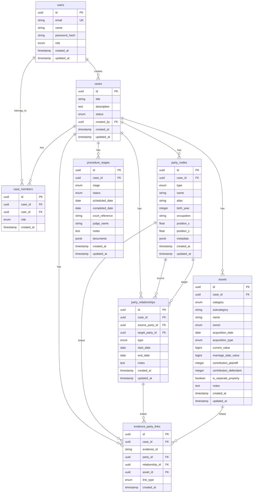

# CHAGOK Lawyer Portal v1 데이터 모델

**Feature Branch**: `007-lawyer-portal-v1`
**버전**: v1.0
**작성일**: 2025-12-08

---

## 1. 개요

본 문서는 CHAGOK Lawyer Portal v1의 **데이터 모델 상세 설계**를 정의한다.

**SSOT 준수 원칙**:
- 기존 테이블(`users`, `cases`, `case_members`, `audit_log`)은 수정하지 않음
- 신규 테이블만 추가하며 FK로 기존 테이블 참조

---

## 2. ERD (Entity Relationship Diagram)



---

## 3. 테이블 상세 정의

### 3.1 party_nodes (당사자 노드)

사건에 등장하는 모든 인물(원고, 피고, 제3자, 자녀 등)을 저장.

```sql
CREATE TYPE party_type AS ENUM (
    'plaintiff',     -- 원고 (의뢰인)
    'defendant',     -- 피고 (상대방)
    'third_party',   -- 제3자 (불륜상대, 증인 등)
    'child',         -- 자녀
    'family'         -- 친족
);

CREATE TABLE party_nodes (
    id UUID PRIMARY KEY DEFAULT gen_random_uuid(),
    case_id UUID NOT NULL REFERENCES cases(id) ON DELETE CASCADE,
    type party_type NOT NULL,
    name VARCHAR(100) NOT NULL,
    alias VARCHAR(50),                    -- 소장용 가명 (김○○)
    birth_year INTEGER,                   -- 생년 (YYYY)
    occupation VARCHAR(100),              -- 직업
    position_x FLOAT DEFAULT 0,           -- React Flow X 좌표
    position_y FLOAT DEFAULT 0,           -- React Flow Y 좌표
    metadata JSONB DEFAULT '{}',          -- 추가 정보
    created_at TIMESTAMP WITH TIME ZONE DEFAULT NOW(),
    updated_at TIMESTAMP WITH TIME ZONE DEFAULT NOW(),

    -- 인덱스
    CONSTRAINT party_nodes_case_id_idx UNIQUE (case_id, name)
);

CREATE INDEX idx_party_nodes_case_id ON party_nodes(case_id);
CREATE INDEX idx_party_nodes_type ON party_nodes(type);

-- updated_at 자동 업데이트 트리거
CREATE TRIGGER update_party_nodes_updated_at
    BEFORE UPDATE ON party_nodes
    FOR EACH ROW
    EXECUTE FUNCTION update_updated_at_column();
```

| 컬럼 | 타입 | 제약 | 설명 |
|------|------|------|------|
| `id` | UUID | PK | 고유 식별자 |
| `case_id` | UUID | FK, NOT NULL | 사건 참조 |
| `type` | ENUM | NOT NULL | 당사자 유형 |
| `name` | VARCHAR(100) | NOT NULL | 실명 또는 가명 |
| `alias` | VARCHAR(50) | NULL | 소장용 가명 |
| `birth_year` | INTEGER | NULL | 생년 |
| `occupation` | VARCHAR(100) | NULL | 직업 |
| `position_x` | FLOAT | DEFAULT 0 | React Flow X 좌표 |
| `position_y` | FLOAT | DEFAULT 0 | React Flow Y 좌표 |
| `metadata` | JSONB | DEFAULT '{}' | 추가 정보 |
| `created_at` | TIMESTAMP | DEFAULT NOW() | 생성일시 |
| `updated_at` | TIMESTAMP | DEFAULT NOW() | 수정일시 |

---

### 3.2 party_relationships (당사자 관계)

두 당사자 간의 관계를 저장.

```sql
CREATE TYPE relationship_type AS ENUM (
    'marriage',      -- 혼인
    'affair',        -- 불륜관계
    'parent_child',  -- 부모-자녀
    'sibling',       -- 형제자매
    'in_law',        -- 인척
    'cohabit'        -- 동거
);

CREATE TABLE party_relationships (
    id UUID PRIMARY KEY DEFAULT gen_random_uuid(),
    case_id UUID NOT NULL REFERENCES cases(id) ON DELETE CASCADE,
    source_party_id UUID NOT NULL REFERENCES party_nodes(id) ON DELETE CASCADE,
    target_party_id UUID NOT NULL REFERENCES party_nodes(id) ON DELETE CASCADE,
    type relationship_type NOT NULL,
    start_date DATE,                      -- 관계 시작일
    end_date DATE,                        -- 관계 종료일
    notes TEXT,                           -- 메모
    created_at TIMESTAMP WITH TIME ZONE DEFAULT NOW(),
    updated_at TIMESTAMP WITH TIME ZONE DEFAULT NOW(),

    -- 중복 방지 (같은 두 당사자 간 동일 유형 관계)
    CONSTRAINT party_relationships_unique
        UNIQUE (case_id, source_party_id, target_party_id, type),
    -- 자기 참조 방지
    CONSTRAINT party_relationships_no_self
        CHECK (source_party_id != target_party_id)
);

CREATE INDEX idx_party_relationships_case_id ON party_relationships(case_id);
CREATE INDEX idx_party_relationships_source ON party_relationships(source_party_id);
CREATE INDEX idx_party_relationships_target ON party_relationships(target_party_id);
CREATE INDEX idx_party_relationships_type ON party_relationships(type);

CREATE TRIGGER update_party_relationships_updated_at
    BEFORE UPDATE ON party_relationships
    FOR EACH ROW
    EXECUTE FUNCTION update_updated_at_column();
```

| 컬럼 | 타입 | 제약 | 설명 |
|------|------|------|------|
| `id` | UUID | PK | 고유 식별자 |
| `case_id` | UUID | FK, NOT NULL | 사건 참조 |
| `source_party_id` | UUID | FK, NOT NULL | 출발 당사자 |
| `target_party_id` | UUID | FK, NOT NULL | 도착 당사자 |
| `type` | ENUM | NOT NULL | 관계 유형 |
| `start_date` | DATE | NULL | 관계 시작일 |
| `end_date` | DATE | NULL | 관계 종료일 |
| `notes` | TEXT | NULL | 메모 |
| `created_at` | TIMESTAMP | DEFAULT NOW() | 생성일시 |
| `updated_at` | TIMESTAMP | DEFAULT NOW() | 수정일시 |

---

### 3.3 assets (재산 목록) [v1 optional]

재산분할 대상 자산을 저장.

```sql
CREATE TYPE asset_category AS ENUM (
    'real_estate',   -- 부동산
    'financial',     -- 금융자산
    'retirement',    -- 퇴직급여
    'insurance',     -- 보험
    'movable',       -- 동산
    'debt',          -- 채무
    'separate'       -- 특유재산
);

CREATE TYPE asset_owner AS ENUM (
    'plaintiff',     -- 원고 단독
    'defendant',     -- 피고 단독
    'joint'          -- 공동
);

CREATE TYPE acquisition_type AS ENUM (
    'purchase',      -- 매입
    'inheritance',   -- 상속
    'gift',          -- 증여
    'salary',        -- 급여/퇴직금
    'other'          -- 기타
);

CREATE TABLE assets (
    id UUID PRIMARY KEY DEFAULT gen_random_uuid(),
    case_id UUID NOT NULL REFERENCES cases(id) ON DELETE CASCADE,
    category asset_category NOT NULL,
    subcategory VARCHAR(50),              -- 중분류 (아파트, 예금 등)
    name VARCHAR(200) NOT NULL,           -- 자산명
    owner asset_owner NOT NULL DEFAULT 'joint',
    acquisition_date DATE,                -- 취득일
    acquisition_type acquisition_type,    -- 취득 경위
    current_value BIGINT NOT NULL DEFAULT 0,  -- 현재 평가액 (원)
    marriage_date_value BIGINT,           -- 혼인일 기준 가치
    contribution_plaintiff INTEGER DEFAULT 50 CHECK (contribution_plaintiff >= 0 AND contribution_plaintiff <= 100),
    contribution_defendant INTEGER DEFAULT 50 CHECK (contribution_defendant >= 0 AND contribution_defendant <= 100),
    is_separate_property BOOLEAN DEFAULT FALSE,  -- 특유재산 여부
    notes TEXT,
    created_at TIMESTAMP WITH TIME ZONE DEFAULT NOW(),
    updated_at TIMESTAMP WITH TIME ZONE DEFAULT NOW(),

    -- 기여율 합계 검증
    CONSTRAINT assets_contribution_sum
        CHECK (contribution_plaintiff + contribution_defendant = 100)
);

CREATE INDEX idx_assets_case_id ON assets(case_id);
CREATE INDEX idx_assets_category ON assets(category);
CREATE INDEX idx_assets_owner ON assets(owner);

CREATE TRIGGER update_assets_updated_at
    BEFORE UPDATE ON assets
    FOR EACH ROW
    EXECUTE FUNCTION update_updated_at_column();
```

| 컬럼 | 타입 | 제약 | 설명 |
|------|------|------|------|
| `id` | UUID | PK | 고유 식별자 |
| `case_id` | UUID | FK, NOT NULL | 사건 참조 |
| `category` | ENUM | NOT NULL | 자산 대분류 |
| `subcategory` | VARCHAR(50) | NULL | 자산 중분류 |
| `name` | VARCHAR(200) | NOT NULL | 자산명 |
| `owner` | ENUM | DEFAULT 'joint' | 명의자 |
| `acquisition_date` | DATE | NULL | 취득일 |
| `acquisition_type` | ENUM | NULL | 취득 경위 |
| `current_value` | BIGINT | DEFAULT 0 | 현재 평가액 |
| `marriage_date_value` | BIGINT | NULL | 혼인일 기준 가치 |
| `contribution_plaintiff` | INTEGER | DEFAULT 50 | 원고 기여율 |
| `contribution_defendant` | INTEGER | DEFAULT 50 | 피고 기여율 |
| `is_separate_property` | BOOLEAN | DEFAULT FALSE | 특유재산 여부 |
| `notes` | TEXT | NULL | 메모 |
| `created_at` | TIMESTAMP | DEFAULT NOW() | 생성일시 |
| `updated_at` | TIMESTAMP | DEFAULT NOW() | 수정일시 |

---

### 3.4 procedure_stages (절차 단계) [v1 optional]

사건의 소송 절차 진행 상태를 저장.

```sql
CREATE TYPE procedure_stage AS ENUM (
    'filed',              -- 소장 접수
    'served',             -- 송달
    'answered',           -- 답변서
    'mediation',          -- 조정 회부
    'mediation_closed',   -- 조정 종결
    'trial',              -- 본안 이행
    'judgment',           -- 판결 선고
    'appeal',             -- 항소심
    'final'               -- 확정
);

CREATE TYPE stage_status AS ENUM (
    'pending',       -- 대기
    'in_progress',   -- 진행중
    'completed',     -- 완료
    'skipped'        -- 건너뜀
);

CREATE TABLE procedure_stages (
    id UUID PRIMARY KEY DEFAULT gen_random_uuid(),
    case_id UUID NOT NULL REFERENCES cases(id) ON DELETE CASCADE,
    stage procedure_stage NOT NULL,
    status stage_status NOT NULL DEFAULT 'pending',
    scheduled_date DATE,                  -- 예정일
    completed_date DATE,                  -- 완료일
    court_reference VARCHAR(50),          -- 법원 사건번호
    judge_name VARCHAR(50),               -- 담당 판사
    notes TEXT,
    documents JSONB DEFAULT '[]',         -- 관련 서류 [{name, s3_key, uploaded_at}]
    created_at TIMESTAMP WITH TIME ZONE DEFAULT NOW(),
    updated_at TIMESTAMP WITH TIME ZONE DEFAULT NOW(),

    -- 사건당 각 단계는 하나만 존재
    CONSTRAINT procedure_stages_unique
        UNIQUE (case_id, stage)
);

CREATE INDEX idx_procedure_stages_case_id ON procedure_stages(case_id);
CREATE INDEX idx_procedure_stages_status ON procedure_stages(status);
CREATE INDEX idx_procedure_stages_scheduled ON procedure_stages(scheduled_date);

CREATE TRIGGER update_procedure_stages_updated_at
    BEFORE UPDATE ON procedure_stages
    FOR EACH ROW
    EXECUTE FUNCTION update_updated_at_column();
```

| 컬럼 | 타입 | 제약 | 설명 |
|------|------|------|------|
| `id` | UUID | PK | 고유 식별자 |
| `case_id` | UUID | FK, NOT NULL | 사건 참조 |
| `stage` | ENUM | NOT NULL | 절차 단계 |
| `status` | ENUM | DEFAULT 'pending' | 상태 |
| `scheduled_date` | DATE | NULL | 예정일 |
| `completed_date` | DATE | NULL | 완료일 |
| `court_reference` | VARCHAR(50) | NULL | 법원 사건번호 |
| `judge_name` | VARCHAR(50) | NULL | 담당 판사 |
| `notes` | TEXT | NULL | 메모 |
| `documents` | JSONB | DEFAULT '[]' | 관련 서류 |
| `created_at` | TIMESTAMP | DEFAULT NOW() | 생성일시 |
| `updated_at` | TIMESTAMP | DEFAULT NOW() | 수정일시 |

---

### 3.5 evidence_party_links (증거-당사자 연결)

DynamoDB의 증거를 RDS의 당사자/관계/자산과 연결.

```sql
CREATE TYPE link_type AS ENUM (
    'mentions',      -- 언급
    'proves',        -- 증명
    'involves',      -- 관련
    'contradicts'    -- 반박
);

CREATE TABLE evidence_party_links (
    id UUID PRIMARY KEY DEFAULT gen_random_uuid(),
    case_id UUID NOT NULL REFERENCES cases(id) ON DELETE CASCADE,
    evidence_id VARCHAR(100) NOT NULL,    -- DynamoDB evidence_id
    party_id UUID REFERENCES party_nodes(id) ON DELETE CASCADE,
    relationship_id UUID REFERENCES party_relationships(id) ON DELETE CASCADE,
    asset_id UUID REFERENCES assets(id) ON DELETE CASCADE,
    link_type link_type NOT NULL DEFAULT 'mentions',
    created_at TIMESTAMP WITH TIME ZONE DEFAULT NOW(),

    -- 최소 하나의 연결 대상 필요
    CONSTRAINT evidence_party_links_target_required
        CHECK (party_id IS NOT NULL OR relationship_id IS NOT NULL OR asset_id IS NOT NULL)
);

CREATE INDEX idx_evidence_party_links_case_id ON evidence_party_links(case_id);
CREATE INDEX idx_evidence_party_links_evidence_id ON evidence_party_links(evidence_id);
CREATE INDEX idx_evidence_party_links_party_id ON evidence_party_links(party_id);
CREATE INDEX idx_evidence_party_links_relationship_id ON evidence_party_links(relationship_id);
CREATE INDEX idx_evidence_party_links_asset_id ON evidence_party_links(asset_id);
```

| 컬럼 | 타입 | 제약 | 설명 |
|------|------|------|------|
| `id` | UUID | PK | 고유 식별자 |
| `case_id` | UUID | FK, NOT NULL | 사건 참조 |
| `evidence_id` | VARCHAR(100) | NOT NULL | DynamoDB evidence_id |
| `party_id` | UUID | FK, NULL | 연결된 당사자 |
| `relationship_id` | UUID | FK, NULL | 연결된 관계 |
| `asset_id` | UUID | FK, NULL | 연결된 자산 |
| `link_type` | ENUM | DEFAULT 'mentions' | 연결 유형 |
| `created_at` | TIMESTAMP | DEFAULT NOW() | 생성일시 |

---

## 4. Alembic 마이그레이션

### 4.1 마이그레이션 파일 구조

```
backend/alembic/versions/
├── xxx_add_party_nodes.py
├── xxx_add_party_relationships.py
├── xxx_add_assets.py
├── xxx_add_procedure_stages.py
└── xxx_add_evidence_party_links.py
```

### 4.2 마이그레이션 의존성

```
                   ┌─────────────────────┐
                   │  기존 SSOT 테이블    │
                   │  (cases, users)     │
                   └──────────┬──────────┘
                              │
              ┌───────────────┼───────────────┐
              │               │               │
              ▼               ▼               ▼
      ┌───────────┐   ┌───────────┐   ┌───────────┐
      │party_nodes│   │  assets   │   │procedure_ │
      └─────┬─────┘   └───────────┘   │  stages   │
            │                         └───────────┘
            │
            ▼
    ┌───────────────┐
    │party_         │
    │relationships  │
    └───────────────┘
            │
            │
            ▼
    ┌───────────────┐
    │evidence_      │
    │party_links    │
    └───────────────┘
```

---

## 5. DynamoDB 확장 스키마

### 5.1 Evidence JSON 확장

기존 SSOT Evidence JSON에 `_v1_extension` 필드 추가 (optional):

```json
{
  "evidence_id": "ev_001",
  "case_id": "case_123",
  "type": "image",
  "timestamp": "2024-12-25T10:20:00Z",
  "speaker": "원고",
  "labels": ["부정행위"],
  "summary": "불륜 상대와 함께 있는 사진",
  "content": "...",
  "s3_key": "cases/123/evidence/photo.jpg",
  "qdrant_vector_id": "vec_001",

  "_v1_extension": {
    "linked_party_ids": ["party_001", "party_003"],
    "linked_relationship_id": "rel_001",
    "linked_asset_ids": [],
    "link_types": {
      "party_001": "involves",
      "party_003": "involves",
      "rel_001": "proves"
    }
  }
}
```

### 5.2 확장 필드 설명

| 필드 | 타입 | 설명 |
|------|------|------|
| `_v1_extension` | Object | v1 확장 데이터 컨테이너 |
| `linked_party_ids` | string[] | 연결된 당사자 ID 목록 |
| `linked_relationship_id` | string | 연결된 관계 ID |
| `linked_asset_ids` | string[] | 연결된 자산 ID 목록 |
| `link_types` | Object | ID별 연결 유형 매핑 |

---

## 6. TypeScript 타입 정의

### 6.1 Frontend Types

```typescript
// types/party.ts

export type PartyType = 'plaintiff' | 'defendant' | 'third_party' | 'child' | 'family';

export type RelationshipType = 'marriage' | 'affair' | 'parent_child' | 'sibling' | 'in_law' | 'cohabit';

export interface PartyNode {
  id: string;
  case_id: string;
  type: PartyType;
  name: string;
  alias?: string;
  birth_year?: number;
  occupation?: string;
  position: {
    x: number;
    y: number;
  };
  metadata?: Record<string, unknown>;
  created_at: string;
  updated_at: string;
}

export interface PartyRelationship {
  id: string;
  case_id: string;
  source_party_id: string;
  target_party_id: string;
  type: RelationshipType;
  start_date?: string;
  end_date?: string;
  notes?: string;
  created_at: string;
  updated_at: string;
}

export interface PartyGraphData {
  nodes: PartyNode[];
  relationships: PartyRelationship[];
}
```

```typescript
// types/asset.ts

export type AssetCategory = 'real_estate' | 'financial' | 'retirement' | 'insurance' | 'movable' | 'debt' | 'separate';

export type AssetOwner = 'plaintiff' | 'defendant' | 'joint';

export type AcquisitionType = 'purchase' | 'inheritance' | 'gift' | 'salary' | 'other';

export interface Asset {
  id: string;
  case_id: string;
  category: AssetCategory;
  subcategory?: string;
  name: string;
  owner: AssetOwner;
  acquisition_date?: string;
  acquisition_type?: AcquisitionType;
  current_value: number;
  marriage_date_value?: number;
  contribution_plaintiff: number;
  contribution_defendant: number;
  is_separate_property: boolean;
  notes?: string;
  created_at: string;
  updated_at: string;
}

export interface DivisionCalculation {
  case_id: string;
  total_joint_assets: number;
  total_separate_plaintiff: number;
  total_separate_defendant: number;
  total_debts: number;
  net_divisible: number;
  division_ratio: {
    plaintiff: number;
    defendant: number;
  };
  plaintiff_share: number;
  defendant_share: number;
  settlement_amount?: number;
  calculated_at: string;
}
```

```typescript
// types/procedure.ts

export type ProcedureStage =
  | 'filed'
  | 'served'
  | 'answered'
  | 'mediation'
  | 'mediation_closed'
  | 'trial'
  | 'judgment'
  | 'appeal'
  | 'final';

export type StageStatus = 'pending' | 'in_progress' | 'completed' | 'skipped';

export interface ProcedureStageRecord {
  id: string;
  case_id: string;
  stage: ProcedureStage;
  status: StageStatus;
  scheduled_date?: string;
  completed_date?: string;
  court_reference?: string;
  judge_name?: string;
  notes?: string;
  documents?: {
    name: string;
    s3_key: string;
    uploaded_at: string;
  }[];
  created_at: string;
  updated_at: string;
}
```

### 6.2 Backend Pydantic Schemas

```python
# backend/app/schemas/party.py

from enum import Enum
from typing import Optional, Dict, Any, List
from pydantic import BaseModel
from datetime import date, datetime

class PartyType(str, Enum):
    PLAINTIFF = "plaintiff"
    DEFENDANT = "defendant"
    THIRD_PARTY = "third_party"
    CHILD = "child"
    FAMILY = "family"

class RelationshipType(str, Enum):
    MARRIAGE = "marriage"
    AFFAIR = "affair"
    PARENT_CHILD = "parent_child"
    SIBLING = "sibling"
    IN_LAW = "in_law"
    COHABIT = "cohabit"

class Position(BaseModel):
    x: float = 0
    y: float = 0

class PartyNodeCreate(BaseModel):
    type: PartyType
    name: str
    alias: Optional[str] = None
    birth_year: Optional[int] = None
    occupation: Optional[str] = None
    position: Position = Position()
    metadata: Optional[Dict[str, Any]] = None

class PartyNodeUpdate(BaseModel):
    name: Optional[str] = None
    alias: Optional[str] = None
    birth_year: Optional[int] = None
    occupation: Optional[str] = None
    position: Optional[Position] = None
    metadata: Optional[Dict[str, Any]] = None

class PartyNodeResponse(BaseModel):
    id: str
    case_id: str
    type: PartyType
    name: str
    alias: Optional[str]
    birth_year: Optional[int]
    occupation: Optional[str]
    position: Position
    metadata: Optional[Dict[str, Any]]
    created_at: datetime
    updated_at: datetime

class RelationshipCreate(BaseModel):
    source_party_id: str
    target_party_id: str
    type: RelationshipType
    start_date: Optional[date] = None
    end_date: Optional[date] = None
    notes: Optional[str] = None

class RelationshipResponse(BaseModel):
    id: str
    case_id: str
    source_party_id: str
    target_party_id: str
    type: RelationshipType
    start_date: Optional[date]
    end_date: Optional[date]
    notes: Optional[str]
    created_at: datetime
    updated_at: datetime

class PartyGraphResponse(BaseModel):
    nodes: List[PartyNodeResponse]
    relationships: List[RelationshipResponse]
```

---

## 7. 인덱스 전략

### 7.1 Primary Use Cases 및 인덱스

| Use Case | 쿼리 패턴 | 인덱스 |
|----------|----------|--------|
| 사건별 당사자 조회 | `WHERE case_id = ?` | `idx_party_nodes_case_id` |
| 사건별 관계 조회 | `WHERE case_id = ?` | `idx_party_relationships_case_id` |
| 당사자별 관계 조회 | `WHERE source_party_id = ?` | `idx_party_relationships_source` |
| 유형별 관계 필터 | `WHERE type = ?` | `idx_party_relationships_type` |
| 증거별 연결 조회 | `WHERE evidence_id = ?` | `idx_evidence_party_links_evidence_id` |
| 예정 기일 조회 | `WHERE scheduled_date BETWEEN ? AND ?` | `idx_procedure_stages_scheduled` |

---

## 8. 데이터 정합성 규칙

### 8.1 비즈니스 규칙

1. **당사자 삭제 시 연결 관계도 삭제** (CASCADE)
2. **사건 종료 시 관련 데이터 soft-delete 고려**
3. **기여율 합계는 항상 100%**
4. **자기 참조 관계 금지** (source != target)

### 8.2 데이터 검증

```python
# backend/app/services/party_service.py

def validate_relationship(
    source_party_id: str,
    target_party_id: str,
    case_id: str
) -> bool:
    """관계 생성 전 검증"""
    # 1. 자기 참조 검증
    if source_party_id == target_party_id:
        raise ValueError("자기 참조 관계는 생성할 수 없습니다.")

    # 2. 동일 사건 소속 검증
    source = get_party(source_party_id)
    target = get_party(target_party_id)
    if source.case_id != case_id or target.case_id != case_id:
        raise ValueError("다른 사건의 당사자와 관계를 생성할 수 없습니다.")

    return True
```

---

**END OF DATA-MODEL.md**
