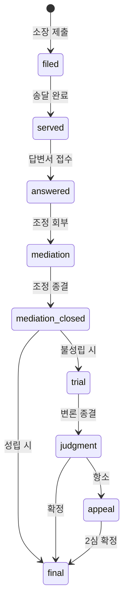
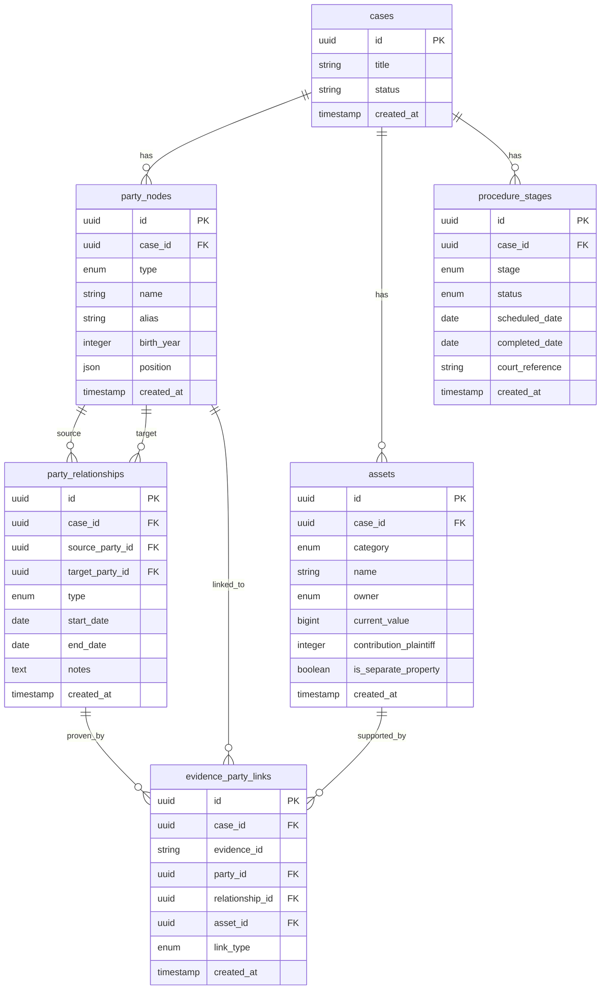

# CHAGOK Lawyer Portal v1 기능 명세서

**Feature Branch**: `007-lawyer-portal-v1`
**버전**: v1.0
**작성일**: 2025-12-08
**Status**: Draft
**관련 문서**: `docs/specs/PRD.md`, `docs/specs/ARCHITECTURE.md`, `docs/specs/API_SPEC.md`, `docs/specs/FRONTEND_SPEC.md`

---

## 0. 문서 개요

본 문서는 CHAGOK(CHAGOK) Lawyer Portal의 **v1 완성형 설계**를 정의한다.

**핵심 신규 기능**:
1. **당사자 관계도 (Party Relationship Graph)** - React Flow 기반 시각화
2. **재산분할표 (Financial Asset Sheet)** - 한국 이혼 재산분할 전용
3. **절차 단계 모델 (Procedure Stage Model)** - 한국 가사소송법 기반

**SSOT 준수 원칙**:
- 기존 SSOT 문서(`PRD.md`, `ARCHITECTURE.md`, `API_SPEC.md`, `FRONTEND_SPEC.md`)는 수정하지 않음
- 본 문서는 SSOT의 **확장(Extension)**으로 작성됨
- `v1 optional` 또는 `v2 proposal` 명시

---

## Clarifications

### Session 2025-12-08

- Q: Concurrent editing strategy for Party Relationship Graph? → A: Last-write-wins (LWW) - no conflict handling in v1
- Q: Empty state for Party Relationship Graph? → A: Empty canvas with "원고/피고 추가하기" CTA button + brief instruction
- Q: Access control for Party/Asset data? → A: Reuse case_members model (OWNER/MEMBER=edit, VIEWER=read-only)
- Q: Save behavior for Party Graph edits? → A: Auto-save with debounce (2-3초 after last edit)
- Q: v1 optional features (Asset Sheet, Procedure Stage) scope? → A: Stretch goal - implement after Party Graph if time permits

---

## 1. 페르소나 정의

### 1.1 Primary Persona: 변호사 (Lawyer)

| 속성 | 설명 |
|------|------|
| **역할** | 이혼 전문 변호사 |
| **연령대** | 35-55세 |
| **기술 수준** | 중급 (Excel, 기본 웹앱 사용 가능) |
| **Pain Points** | 증거 정리 시간 과다, 당사자 관계 파악 어려움, 재산분할 계산 복잡 |
| **핵심 니즈** | 사건 전체 조망, 논점별 증거 정리, 유책사유 자동 분류 |

### 1.2 Secondary Persona: 파라리걸 (Paralegal/Staff)

| 속성 | 설명 |
|------|------|
| **역할** | 증거 수집 및 정리 담당 |
| **연령대** | 25-40세 |
| **기술 수준** | 중상급 |
| **Pain Points** | 반복적인 증거 분류 작업, 변호사와의 진행상황 공유 어려움 |
| **핵심 니즈** | 효율적인 증거 업로드, 자동 분류, 진행현황 대시보드 |

### 1.3 Tertiary Persona: 의뢰인 (Client)

| 속성 | 설명 |
|------|------|
| **역할** | 이혼 소송 당사자 |
| **연령대** | 30-60세 |
| **기술 수준** | 초중급 |
| **Pain Points** | 진행 상황 불투명, 변호사와 소통 어려움 |
| **핵심 니즈** | 실시간 진행현황 확인, 간편한 증거 제출 |

---

## 2. 핵심 니즈 (Top Needs)

### 2.1 변호사 핵심 니즈

| 순위 | 니즈 | 현재 Pain | 목표 Gain |
|------|------|-----------|-----------|
| **N1** | 사건 관계 조망 | 당사자 관계 텍스트로만 파악 | React Flow로 시각적 관계도 |
| **N2** | 재산분할 계산 | Excel 수작업 | 자동 계산 + 분할안 제안 |
| **N3** | 절차 진행관리 | 법원 일정 수동 관리 | 단계별 자동 트래킹 |
| **N4** | 증거 기반 초안 | RAG 없이 수동 작성 | 증거 인용 자동화 |

### 2.2 기능별 우선순위 매핑

```
N1 (관계 조망)  → Party Relationship Graph [v1 필수]
N2 (재산분할)   → Financial Asset Sheet [v1 optional]
N3 (절차관리)   → Procedure Stage Model [v1 optional]
N4 (초안생성)   → 기존 SSOT Draft Preview 확장 [v2 proposal]
```

---

## 3. SSOT 제약 조건

### 3.1 기존 SSOT 엔티티 (수정 불가)

| 문서 | 엔티티 | 비고 |
|------|--------|------|
| `PRD.md` | Evidence JSON Schema | DynamoDB 저장 형식 |
| `ARCHITECTURE.md` | S3 Event → AI Worker 파이프라인 | 변경 불가 |
| `API_SPEC.md` | `/cases`, `/evidence`, `/draft-preview` | 기존 API 유지 |
| `FRONTEND_SPEC.md` | EvidenceTimeline, DraftPreview 컴포넌트 | 기존 컴포넌트 유지 |

### 3.2 확장 가능 영역

| 영역 | 확장 방식 | 제약 |
|------|----------|------|
| **DB Schema** | 신규 테이블 추가 (RDS) | 기존 테이블 스키마 변경 금지 |
| **API Endpoints** | 신규 엔드포인트 추가 | 기존 엔드포인트 시그니처 유지 |
| **Frontend Components** | 신규 컴포넌트 추가 | 기존 컴포넌트 props 유지 |
| **DynamoDB** | 신규 attributes 추가 | 기존 PK/SK 유지 |

---

## 4. User Scenarios & Testing

### US1 - 당사자 관계도 생성 및 편집 (Priority: P1)

**As a** 변호사,
**I want to** 시각적인 당사자 관계도를 생성하고 편집할 수 있기를,
**So that** 복잡한 이혼 사건의 인물 관계를 한눈에 파악할 수 있다.

**Acceptance Scenarios**:

1. **Given** 사건 상세 페이지에서, **When** "관계도" 탭을 클릭하면, **Then** React Flow 캔버스가 표시된다.
2. **Given** 빈 관계도 캔버스에서, **When** "당사자 추가" 버튼을 클릭하면, **Then** 원고/피고/제3자 유형을 선택할 수 있는 모달이 표시된다.
3. **Given** 두 개 이상의 노드가 있을 때, **When** 노드 간 드래그로 연결하면, **Then** 관계 유형(혼인/불륜/친족 등)을 선택하는 모달이 표시된다.
4. **Given** 관계 연결선이 있을 때, **When** 연결선을 클릭하면, **Then** 관계 세부정보(시작일, 종료일, 메모)를 편집할 수 있다.
5. **Given** 완성된 관계도가 있을 때, **When** "저장" 버튼을 클릭하면, **Then** 관계도가 서버에 저장되고 "저장 완료" 토스트가 표시된다.

---

### US2 - 재산분할표 작성 (Priority: P2) [v1 optional]

**As a** 변호사,
**I want to** 사건별 재산분할표를 작성하고 분할 비율을 계산할 수 있기를,
**So that** 재산분할 청구 금액을 정확하게 산정할 수 있다.

**Acceptance Scenarios**:

1. **Given** 사건 상세 페이지에서, **When** "재산분할" 탭을 클릭하면, **Then** 재산분할표 편집기가 표시된다.
2. **Given** 재산분할표에서, **When** "자산 추가" 버튼을 클릭하면, **Then** 자산 유형(부동산/예금/주식/퇴직금/보험/차량/기타)을 선택하고 상세정보를 입력할 수 있다.
3. **Given** 여러 자산이 입력되었을 때, **When** 분할 비율(예: 50:50)을 설정하면, **Then** 각 당사자별 분할 예정 금액이 자동 계산된다.
4. **Given** 특유재산과 공동재산이 구분되어 있을 때, **When** "분할안 계산" 버튼을 클릭하면, **Then** 한국 민법 기준 분할안이 제안된다.
5. **Given** 완성된 재산분할표가 있을 때, **When** "Excel 내보내기"를 클릭하면, **Then** 법원 제출용 형식의 Excel 파일이 다운로드된다.

---

### US3 - 절차 단계 관리 (Priority: P2) [v1 optional]

**As a** 변호사,
**I want to** 사건의 소송 절차 단계를 트래킹하고 다음 단계 액션을 확인할 수 있기를,
**So that** 법원 기일 및 제출 기한을 놓치지 않을 수 있다.

**Acceptance Scenarios**:

1. **Given** 사건 상세 페이지에서, **When** "절차 진행" 탭을 클릭하면, **Then** 현재 단계가 하이라이트된 절차 타임라인이 표시된다.
2. **Given** 절차 타임라인에서, **When** 특정 단계를 클릭하면, **Then** 해당 단계의 상세정보(일자, 결과, 관련 서류)가 표시된다.
3. **Given** 현재 "조정" 단계에 있을 때, **When** "다음 단계로" 버튼을 클릭하면, **Then** 다음 단계 유형(조정성립/불성립→본안이행) 선택 모달이 표시된다.
4. **Given** 기일이 설정된 단계가 있을 때, **When** 기일 3일 전이 되면, **Then** 알림이 발송되고 대시보드에 경고 배지가 표시된다.

---

### US4 - 증거-당사자 연결 (Priority: P1)

**As a** 변호사,
**I want to** 증거를 특정 당사자 또는 관계에 연결할 수 있기를,
**So that** 관계도에서 해당 당사자 클릭 시 관련 증거를 바로 확인할 수 있다.

**Acceptance Scenarios**:

1. **Given** 관계도의 특정 노드(당사자)를 클릭했을 때, **When** 해당 당사자에 연결된 증거가 있으면, **Then** 증거 목록 팝오버가 표시된다.
2. **Given** 증거 상세 모달에서, **When** "당사자 연결" 버튼을 클릭하면, **Then** 관계도의 노드 목록에서 연결할 당사자를 선택할 수 있다.
3. **Given** 관계 연결선(edge)을 클릭했을 때, **When** 해당 관계에 연결된 증거가 있으면, **Then** 해당 관계를 증명하는 증거 목록이 표시된다.

---

### 4.5 Lawyer Amenities - 변호사 업무환경 개선 (Priority: P2)

> **설계 철학**: 이혼 전문 변호사는 고강도 감정노동과 장시간 서면 작업에 노출된다. 이 섹션은 단순 기능 나열이 아닌, **실제 피로와 스트레스를 줄이는 관점**에서 설계한다.

#### 4.5.1 변호사가 겪는 실제 Pain Points

| Pain Point | 발생 상황 | 심리적 영향 |
|------------|----------|------------|
| **기한 불안** | 답변서·준비서면 제출기한이 여러 사건에서 동시다발 | 수면 장애, 번아웃 |
| **정보 분산** | 사건별로 흩어진 증거/메모/일정 | 인지 과부하 |
| **의뢰인 압박** | "제 사건 어떻게 됐나요?" 반복 질문 | 감정 소진 |
| **야간 작업** | 낮에는 재판/상담, 밤에 서면 작성 | 눈 피로, 집중력 저하 |
| **반복 설명** | 양육비/위자료/기간 등 매번 비슷한 질문 | 시간 낭비 |

#### 4.5.2 UI/UX 어메니티

##### A. 다크 모드 (눈 피로 감소)

**문제**: 장시간 밝은 화면 → 안구건조, 두통, 수면 패턴 교란

**솔루션**:
- 시스템 설정 자동 감지 (`prefers-color-scheme`)
- 수동 토글 (헤더 우측 아이콘)
- 3가지 모드: Light / Dark / Auto

**구현 세부**:
```typescript
// types/theme.ts
type ThemeMode = 'light' | 'dark' | 'auto';

// hooks/useTheme.ts
interface UseThemeReturn {
  mode: ThemeMode;
  setMode: (mode: ThemeMode) => void;
  isDark: boolean;  // 실제 적용된 상태
}
```

**색상 팔레트 (Dark Mode)**:
| Token | Light | Dark |
|-------|-------|------|
| `--color-bg-primary` | `#FFFFFF` | `#1A1A2E` |
| `--color-bg-secondary` | `#F5F7FA` | `#16213E` |
| `--color-text-primary` | `#1E1E2D` | `#E8E8E8` |
| `--color-border-default` | `#E5E7EB` | `#2D3748` |

---

##### B. 글로벌 검색 (Cmd/Ctrl + K)

**문제**: 수십 개 사건에서 특정 의뢰인/증거/일정을 찾으려면 여러 페이지 탐색 필요

**솔루션**:
- `Cmd/Ctrl + K` 단축키로 어디서든 검색 팔레트 호출
- 통합 검색: 사건명, 의뢰인명, 증거 요약, 일정, 메모
- 최근 검색어 + 자주 접근 항목 표시

**검색 범위**:
| 카테고리 | 검색 대상 | 표시 형식 |
|----------|----------|----------|
| 사건 | title, description | 📁 사건명 - 상태 |
| 의뢰인 | name, email, phone | 👤 이름 - 연락처 |
| 증거 | summary, labels | 📎 요약 (날짜) |
| 일정 | title, court_reference | 📅 일정명 - 날짜 |

**UI 구성**:
```
┌────────────────────────────────────────────┐
│ 🔍 사건, 의뢰인, 증거, 일정 검색...          │
├────────────────────────────────────────────┤
│ 최근 검색                                   │
│   김○○ 이혼 사건                           │
│   부동산 등기부등본                          │
├────────────────────────────────────────────┤
│ 바로가기                                    │
│   오늘 기일이 있는 사건 (2)                  │
│   이번 주 마감 사건 (5)                     │
└────────────────────────────────────────────┘
```

---

##### C. 키보드 단축키

**문제**: 마우스 이동 반복 → 손목 피로, 작업 속도 저하

**단축키 테이블**:
| 단축키 | 동작 | 적용 범위 |
|--------|------|----------|
| `Cmd/Ctrl + K` | 글로벌 검색 | 전역 |
| `Cmd/Ctrl + S` | 저장 | 편집 화면 |
| `Cmd/Ctrl + 1~5` | 탭 전환 | 사건 상세 |
| `Cmd/Ctrl + N` | 새 사건 생성 | 사건 목록 |
| `Cmd/Ctrl + E` | 증거 업로드 | 사건 상세 |
| `Esc` | 모달 닫기 | 전역 |
| `?` | 단축키 도움말 | 전역 |

**구현**:
```typescript
// hooks/useKeyboardShortcuts.ts
const SHORTCUTS = {
  'mod+k': () => openCommandPalette(),
  'mod+s': () => saveCurrentDocument(),
  'mod+1': () => switchTab(0),
  // ...
};
```

---

##### D. 자동 저장 + 버전 복구

**문제**: 브라우저 크래시/실수로 탭 닫기 → 작업 내용 손실 → 극심한 스트레스

**솔루션**:
- **자동 저장**: 편집 후 3초 idle 시 자동 저장
- **버전 기록**: 최근 10개 버전 유지 (24시간 내)
- **충돌 감지**: 다른 사용자 편집 시 알림

**자동 저장 상태 표시**:
```
저장됨 ✓ 10초 전
저장 중... ⏳
저장 실패 ⚠️ (다시 시도)
```

**버전 복구 UI**:
```
┌─────────────────────────────────────┐
│ 버전 기록                            │
├─────────────────────────────────────┤
│ ● 현재 버전                          │
│ ○ 10분 전 - 자동 저장                │
│ ○ 30분 전 - 자동 저장                │
│ ○ 1시간 전 - 수동 저장               │
│                                     │
│ [이 버전으로 복구]                    │
└─────────────────────────────────────┘
```

---

#### 4.5.3 대시보드 어메니티

##### A. Today View (오늘의 할 일)

**문제**: 아침에 출근해서 "오늘 뭐부터 해야 하지?" 결정 피로

**솔루션**:
- 대시보드 최상단에 **Today Card** 고정
- 오늘/이번 주 반드시 해야 할 일을 우선순위로 정렬

**Today Card 구성**:
```
┌─────────────────────────────────────────────────────┐
│ 📌 오늘의 할 일 (2024.12.08 월요일)                  │
├─────────────────────────────────────────────────────┤
│ 🔴 긴급                                              │
│   • 김○○ 사건 답변서 제출 (오늘 17:00 마감)          │
│   • 이○○ 사건 변론기일 (오전 10:30, 서울가정법원)    │
├─────────────────────────────────────────────────────┤
│ 🟡 이번 주                                           │
│   • 박○○ 사건 준비서면 (12/10 마감) - D-2           │
│   • 최○○ 사건 조정기일 (12/11 14:00)                │
├─────────────────────────────────────────────────────┤
│ 📊 진행 현황: 8건 중 3건 기일 임박                   │
└─────────────────────────────────────────────────────┘
```

**우선순위 로직**:
```typescript
interface TodoItem {
  case_id: string;
  type: 'deadline' | 'court_date' | 'task';
  due_date: string;
  priority: 'urgent' | 'high' | 'normal';
  title: string;
}

// 정렬 기준
// 1. 오늘 마감 > 이번 주 마감 > 그 외
// 2. 법원 기일 > 서면 마감 > 일반 업무
// 3. 마감일 오름차순
```

---

##### B. 위험 사건 하이라이트

**문제**: 수십 건 중 **진짜 위험한 사건**이 묻혀서 놓침

**위험 사건 기준**:
| 위험 유형 | 조건 | 표시 |
|----------|------|------|
| 🔴 **기한 임박** | 제출 마감 D-3 이내 | 빨간 테두리 + 배지 |
| 🟠 **쟁점 복잡** | 당사자 5명 이상 또는 자산 10건 이상 | 주황 라벨 |
| 🟡 **증거 부족** | 유책사유 라벨 있으나 증거 3개 미만 | 노랑 경고 |
| 🔵 **의뢰인 불안** | 최근 7일 내 메시지 5개 이상 | 파랑 알림 |

**사건 목록 표시**:
```
┌─────────────────────────────────────────────────────┐
│ 🔴 김○○ 이혼 사건                    D-2 기한임박   │
│    부정행위 입증 | 증거 12건 | 다음 기일: 12/10     │
├─────────────────────────────────────────────────────┤
│ 🟠 이○○ 이혼 사건                    쟁점복잡       │
│    재산분할 | 자산 15건 | 당사자 6명               │
├─────────────────────────────────────────────────────┤
│    박○○ 이혼 사건                                  │
│    양육권 | 증거 8건 | 다음 기일: 12/20           │
└─────────────────────────────────────────────────────┘
```

---

##### C. 주간 캘린더 위젯

**위치**: 대시보드 우측 사이드바

**표시 내용**:
- 이번 주 법원 기일
- 서면 제출 마감일
- 의뢰인 상담 일정

```
┌─────────────────────┐
│ 📅 이번 주          │
├─────────────────────┤
│ 월 08 ● 변론기일    │
│ 화 09               │
│ 수 10 ● 답변서 마감 │
│ 목 11 ● 조정기일    │
│ 금 12               │
└─────────────────────┘
```

---

#### 4.5.4 의뢰인 스트레스 완화 도구

##### A. 진행 상태 요약 카드 (Explainer Card)

**문제**: 의뢰인이 "제 사건 어떻게 됐나요?" 물으면 매번 설명에 시간 소모

**솔루션**:
- 사건별 **1장짜리 요약 카드** 자동 생성
- 의뢰인 통화/상담 시 화면 공유하거나 PDF로 전송

**요약 카드 구성**:
```
┌─────────────────────────────────────────────────────┐
│            사건 진행 현황 요약                       │
│            김○○ 이혼 사건 (2024가합12345)           │
├─────────────────────────────────────────────────────┤
│ 📍 현재 단계: 조정 절차 진행 중                      │
│                                                     │
│ ✅ 완료된 단계                                      │
│    • 소장 접수 (2024.10.15)                        │
│    • 송달 완료 (2024.10.25)                        │
│    • 답변서 접수 (2024.11.20)                      │
│                                                     │
│ 📌 다음 일정                                        │
│    • 조정기일: 2024.12.11 14:00                    │
│    • 장소: 서울가정법원 305호                       │
│                                                     │
│ 📊 증거 현황: 12건 수집 완료                        │
│    • 부정행위 관련 8건                             │
│    • 재산분할 관련 4건                             │
│                                                     │
│ 💬 담당 변호사: 홍길동 (02-1234-5678)              │
└─────────────────────────────────────────────────────┘
```

**생성 방식**:
- **자동 생성**: 절차 단계 변경 시 자동 업데이트
- **수동 편집**: 변호사가 코멘트 추가 가능
- **공유 옵션**: PDF 다운로드 / 이메일 발송 / 링크 공유

---

##### B. FAQ 답변 템플릿 + AI 초안

**문제**: "위자료 얼마 받을 수 있나요?", "기간이 얼마나 걸리나요?" 등 반복 질문

**솔루션**:
- **자주 묻는 질문 템플릿** 미리 준비
- **AI 기반 초안**: 해당 사건 데이터 기반으로 맞춤 답변 생성

**FAQ 템플릿 카테고리**:
| 카테고리 | 예시 질문 |
|----------|----------|
| **위자료** | 위자료 얼마 받을 수 있나요? |
| **양육비** | 양육비 기준은 어떻게 되나요? |
| **재산분할** | 집은 누가 갖게 되나요? |
| **기간** | 소송 기간이 얼마나 걸리나요? |
| **절차** | 조정이 뭔가요? 꼭 해야 하나요? |
| **비용** | 변호사 비용 외에 추가 비용이 있나요? |

**AI 초안 생성**:
```typescript
interface FAQDraftRequest {
  case_id: string;
  question_type: 'alimony' | 'child_support' | 'property' | 'duration' | 'procedure' | 'cost';
  additional_context?: string;
}

interface FAQDraftResponse {
  draft_text: string;
  citations: Array<{
    source: 'evidence' | 'law' | 'precedent';
    reference: string;
  }>;
  disclaimer: string;  // "본 내용은 참고용이며..."
}
```

**UI 예시**:
```
┌─────────────────────────────────────────────────────┐
│ 💬 의뢰인 FAQ 답변 생성                             │
├─────────────────────────────────────────────────────┤
│ 질문 유형: [위자료 ▼]                              │
│                                                     │
│ 📝 AI 초안                                         │
│ ────────────────────────────────────────────────── │
│ 귀하의 사건에서 위자료는 상대방의 유책사유(부정행위) │
│ 입증 정도에 따라 달라집니다. 현재 확보된 증거로는   │
│ 약 3,000만 원 ~ 5,000만 원 수준을 예상할 수 있으나,│
│ 최종 금액은 법원의 판단에 따릅니다.                │
│                                                     │
│ [📋 복사] [✏️ 편집] [📤 의뢰인에게 전송]           │
└─────────────────────────────────────────────────────┘
```

---

#### 4.5.5 User Stories (Amenities)

##### US5 - 다크 모드 토글 (Priority: P2)

**As a** 야간 작업이 많은 변호사,
**I want to** 다크 모드를 켤 수 있기를,
**So that** 장시간 서면 작업 시 눈 피로를 줄일 수 있다.

**Acceptance Scenarios**:
1. **Given** 시스템 설정이 다크 모드일 때, **When** 앱을 처음 열면, **Then** 자동으로 다크 모드가 적용된다.
2. **Given** 헤더의 테마 토글 버튼을 클릭하면, **When** 모드가 변경되면, **Then** 즉시 전체 UI 색상이 전환된다.
3. **Given** 수동으로 라이트 모드를 선택했을 때, **When** 다음에 앱을 열면, **Then** 사용자 설정이 유지된다.

---

##### US6 - 글로벌 검색 (Priority: P2)

**As a** 다수 사건을 담당하는 변호사,
**I want to** 어디서든 빠르게 검색할 수 있기를,
**So that** 특정 의뢰인이나 증거를 즉시 찾을 수 있다.

**Acceptance Scenarios**:
1. **Given** 어떤 페이지에서든, **When** `Cmd/Ctrl + K`를 누르면, **Then** 검색 팔레트가 표시된다.
2. **Given** 검색어를 입력하면, **When** 0.5초 후, **Then** 사건/의뢰인/증거 통합 검색 결과가 표시된다.
3. **Given** 검색 결과에서 항목을 클릭하면, **When** 해당 페이지로 이동하고, **Then** 검색 팔레트가 닫힌다.

---

##### US7 - Today View (Priority: P2)

**As a** 바쁜 변호사,
**I want to** 오늘 해야 할 일을 한눈에 볼 수 있기를,
**So that** 아침에 출근해서 바로 중요한 일부터 시작할 수 있다.

**Acceptance Scenarios**:
1. **Given** 대시보드에 접속하면, **When** 오늘 마감/기일이 있으면, **Then** Today Card 최상단에 긴급 항목으로 표시된다.
2. **Given** 이번 주 마감이 있으면, **When** Today Card를 보면, **Then** D-day 카운트와 함께 표시된다.
3. **Given** 모든 항목을 완료하면, **When** Today Card를 보면, **Then** "오늘 할 일을 모두 완료했습니다" 메시지가 표시된다.

---

##### US8 - 진행 상태 요약 카드 (Priority: P3)

**As a** 의뢰인 상담이 많은 변호사,
**I want to** 사건 진행 상황을 1장으로 요약한 카드를 생성할 수 있기를,
**So that** 의뢰인에게 쉽게 설명하고 공유할 수 있다.

**Acceptance Scenarios**:
1. **Given** 사건 상세 페이지에서, **When** "요약 카드 생성" 버튼을 클릭하면, **Then** 현재 상태 기반 요약 카드가 표시된다.
2. **Given** 요약 카드가 생성되면, **When** "PDF 다운로드"를 클릭하면, **Then** A4 크기 PDF 파일이 다운로드된다.
3. **Given** 요약 카드에서, **When** "의뢰인에게 전송"을 클릭하면, **Then** 이메일 발송 모달이 표시된다.

---

#### 4.5.6 기술 구현 요약

| 기능 | 프론트엔드 | 백엔드 | 우선순위 |
|------|-----------|--------|----------|
| 다크 모드 | CSS Variables + Context | - | P2 |
| 글로벌 검색 | cmdk 라이브러리 | `/search` API | P2 |
| 키보드 단축키 | useKeyboardShortcuts hook | - | P2 |
| 자동 저장 | useDebouncedSave hook | PATCH API | P2 |
| Today View | TodayCard 컴포넌트 | `/dashboard/today` API | P2 |
| 위험 사건 | RiskBadge 컴포넌트 | risk 필드 계산 로직 | P2 |
| 요약 카드 | ExplainerCard 컴포넌트 | `/cases/{id}/summary` API | P3 |
| FAQ 템플릿 | FAQTemplates 컴포넌트 | `/faq/draft` API (AI) | P3 |

---

#### 4.5.7 피로 감소 효과 측정 지표

| 지표 | 측정 방법 | 목표 |
|------|----------|------|
| **검색 시간 단축** | 검색 팔레트 사용률 추적 | 평균 탐색 시간 50% 감소 |
| **기한 준수율** | 마감 D-0 제출 vs D-3 제출 비율 | D-3 이전 제출 80% 이상 |
| **의뢰인 문의 응대 시간** | FAQ 템플릿 사용률 | 응대 시간 40% 단축 |
| **야간 작업 시간** | 다크 모드 활성화 시간대 분석 | 18시 이후 사용자 만족도 조사 |

---

## 5. 신규 기능 상세

### 5.1 Party Relationship Graph [v1 필수]

#### 5.1.1 개요

React Flow 기반의 대화형 당사자 관계도 시각화 컴포넌트.

#### 5.1.2 노드 유형 (Party Types)

| 유형 | 아이콘 | 설명 | 색상 |
|------|--------|------|------|
| `plaintiff` | 원 | 원고 (의뢰인) | `--color-primary` |
| `defendant` | 사각형 | 피고 (상대방) | `--color-danger` |
| `third_party` | 다이아몬드 | 제3자 (불륜상대, 증인 등) | `--color-warning` |
| `child` | 작은 원 | 자녀 | `--color-success` |
| `family` | 육각형 | 친족 | `--color-secondary` |

#### 5.1.3 엣지 유형 (Relationship Types)

| 유형 | 라벨 | 스타일 | 민법 조항 |
|------|------|--------|----------|
| `marriage` | 혼인 | 실선 (두꺼움) | - |
| `affair` | 불륜관계 | 점선 (빨강) | 제840조 1호 |
| `parent_child` | 부모-자녀 | 실선 (세로) | - |
| `sibling` | 형제자매 | 점선 (회색) | - |
| `in_law` | 인척 | 점선 (파랑) | - |
| `cohabit` | 동거 | 파선 | - |

#### 5.1.4 노드 데이터 구조

```typescript
interface PartyNode {
  id: string;                    // UUID
  case_id: string;               // FK → cases.id
  type: 'plaintiff' | 'defendant' | 'third_party' | 'child' | 'family';
  name: string;                  // 실명 또는 가명
  alias?: string;                // 소장용 가명 (김○○)
  birth_year?: number;           // 생년
  occupation?: string;           // 직업
  position: { x: number; y: number };  // React Flow 좌표
  metadata?: Record<string, unknown>;
  created_at: string;
  updated_at: string;
}
```

#### 5.1.5 동시성 모델

**Concurrency Strategy:** Last-write-wins (LWW)
- 복수 사용자가 동시 편집 시 마지막 저장이 우선
- v1에서는 충돌 감지/알림 미구현
- 실무상 단일 담당자가 관계도 편집하는 패턴에 적합

#### 5.1.6 UI 상태 처리

**Empty State (당사자 없음):**
- 빈 캔버스 + 중앙에 "원고/피고 추가하기" CTA 버튼
- 간단한 안내 텍스트: "당사자를 추가하여 관계도를 시작하세요"
- CTA 클릭 시 당사자 추가 모달 표시

**Loading State:**
- 스켈레톤 캔버스 표시

**Error State:**
- 에러 메시지 + "다시 시도" 버튼

**Auto-Save Behavior:**
- 모든 편집(노드 추가/수정/삭제, 엣지 변경, 위치 이동)은 debounce 2-3초 후 자동 저장
- 저장 중: 상태 표시 아이콘 (spinner)
- 저장 완료: "저장됨" 표시 (2초 후 fade out)
- 저장 실패: 에러 토스트 + 재시도 버튼

#### 5.1.7 엣지 데이터 구조

```typescript
interface PartyRelationship {
  id: string;                    // UUID
  case_id: string;               // FK → cases.id
  source_party_id: string;       // FK → party_nodes.id
  target_party_id: string;       // FK → party_nodes.id
  type: 'marriage' | 'affair' | 'parent_child' | 'sibling' | 'in_law' | 'cohabit';
  start_date?: string;           // ISO8601
  end_date?: string;             // ISO8601
  notes?: string;
  evidence_ids?: string[];       // 관련 증거 ID 목록
  created_at: string;
  updated_at: string;
}
```

---

### 5.2 Financial Asset Sheet [v1 optional]

#### 5.2.1 개요

한국 이혼 재산분할 전용 스프레드시트형 에디터.

#### 5.2.2 자산 분류 체계

| 대분류 | 중분류 | 한국법 특이사항 |
|--------|--------|-----------------|
| **부동산** | 아파트, 주택, 토지, 상가 | 취득시기/특유재산 여부 |
| **금융자산** | 예금, 적금, 주식, 펀드, 가상자산 | 명의자, 형성 기여도 |
| **퇴직급여** | 퇴직금, 퇴직연금 | 혼인기간 비례 분할 |
| **보험** | 생명보험, 손해보험 | 해약환급금 기준 |
| **동산** | 차량, 귀금속, 가전 | 감가상각 적용 |
| **채무** | 주택담보대출, 신용대출 | 공동채무/개인채무 구분 |
| **특유재산** | 혼전재산, 상속/증여 | 분할대상 제외 |

#### 5.2.3 자산 데이터 구조

```typescript
interface Asset {
  id: string;                    // UUID
  case_id: string;               // FK → cases.id
  category: 'real_estate' | 'financial' | 'retirement' | 'insurance' | 'movable' | 'debt' | 'separate';
  subcategory: string;           // 중분류
  name: string;                  // 자산명
  owner: 'plaintiff' | 'defendant' | 'joint';
  acquisition_date?: string;     // 취득일
  acquisition_type?: 'purchase' | 'inheritance' | 'gift' | 'salary' | 'other';
  current_value: number;         // 현재 평가액 (원)
  marriage_date_value?: number;  // 혼인일 기준 가치
  contribution_plaintiff?: number;  // 원고 기여율 (0-100)
  contribution_defendant?: number;  // 피고 기여율 (0-100)
  is_separate_property: boolean; // 특유재산 여부
  notes?: string;
  evidence_ids?: string[];       // 관련 증거 ID
  created_at: string;
  updated_at: string;
}
```

#### 5.2.4 분할 계산 로직

```typescript
interface DivisionCalculation {
  case_id: string;
  total_joint_assets: number;          // 공동재산 합계
  total_separate_plaintiff: number;    // 원고 특유재산
  total_separate_defendant: number;    // 피고 특유재산
  total_debts: number;                 // 총 채무
  net_divisible: number;               // 분할대상 순재산
  division_ratio: {
    plaintiff: number;                 // 원고 분할비율 (0-100)
    defendant: number;                 // 피고 분할비율 (0-100)
  };
  plaintiff_share: number;             // 원고 분할액
  defendant_share: number;             // 피고 분할액
  settlement_amount?: number;          // 정산금 (양수: 피고→원고)
  calculated_at: string;
}
```

---

### 5.3 Procedure Stage Model [v1 optional]

#### 5.3.1 개요

한국 가사소송법 기반 이혼소송 절차 단계 모델.

#### 5.3.2 절차 단계 정의

| 단계 | 코드 | 설명 | 평균 소요기간 |
|------|------|------|---------------|
| 소장 접수 | `filed` | 소장 제출 완료 | - |
| 송달 | `served` | 피고에게 소장 송달 | 1-2주 |
| 답변서 | `answered` | 피고 답변서 제출 | 30일 |
| 조정 회부 | `mediation` | 조정 절차 진행 | 2-3개월 |
| 조정 종결 | `mediation_closed` | 성립/불성립/취하 | - |
| 본안 이행 | `trial` | 변론기일 진행 | 3-6개월 |
| 판결 선고 | `judgment` | 1심 판결 | - |
| 항소심 | `appeal` | 2심 진행 (선택) | 6개월 |
| 확정 | `final` | 판결 확정 | - |

#### 5.3.3 절차 단계 데이터 구조

```typescript
interface ProcedureStage {
  id: string;                    // UUID
  case_id: string;               // FK → cases.id
  stage: string;                 // 단계 코드
  status: 'pending' | 'in_progress' | 'completed' | 'skipped';
  scheduled_date?: string;       // 예정일
  completed_date?: string;       // 완료일
  court_reference?: string;      // 법원 사건번호
  judge_name?: string;           // 담당 판사
  notes?: string;
  documents?: {                  // 관련 서류
    name: string;
    s3_key: string;
    uploaded_at: string;
  }[];
  created_at: string;
  updated_at: string;
}
```

#### 5.3.4 절차 흐름 (State Machine)



---

## 6. 도메인 모델 (확장)

### 6.1 신규 엔티티 (RDS PostgreSQL)

기존 SSOT의 `users`, `cases`, `case_members`, `audit_log` 테이블은 유지하고, 아래 테이블을 **추가**한다.

```
┌─────────────────────────────────────────────────────────────────┐
│                     SSOT 기존 엔티티 (유지)                       │
├─────────────────────────────────────────────────────────────────┤
│  users ──┬── case_members ──── cases ──── audit_log             │
│          │                       │                               │
│          │                       │                               │
├──────────┼───────────────────────┼───────────────────────────────┤
│          │    v1 확장 엔티티      │                               │
│          │                       │                               │
│          │              ┌────────┴────────┐                      │
│          │              │                 │                      │
│          │        party_nodes      party_relationships           │
│          │              │                 │                      │
│          │              └────────┬────────┘                      │
│          │                       │                               │
│          │                 ┌─────┴─────┐                         │
│          │                 │           │                         │
│          │              assets    procedure_stages               │
│          │                 │           │                         │
│          │                 └─────┬─────┘                         │
│          │                       │                               │
│          │              evidence_party_links                     │
│          │           (evidence ↔ party 연결)                     │
└─────────────────────────────────────────────────────────────────┘
```

### 6.2 ERD (Mermaid)



### 6.3 DynamoDB 확장 (Evidence JSON)

기존 Evidence JSON Schema에 **optional 필드 추가** (기존 필드 유지):

```json
{
  "evidence_id": "uuid",
  "case_id": "case123",
  "type": "image",
  "timestamp": "2024-12-25T10:20:00Z",
  "speaker": "원고",
  "labels": ["부정행위"],
  "summary": "...",
  "content": "...",
  "s3_key": "cases/123/evidence/abc.jpg",
  "qdrant_vector_id": "op_123",

  "_v1_extension": {
    "linked_party_ids": ["party_001", "party_002"],
    "linked_relationship_id": "rel_001",
    "linked_asset_ids": ["asset_001"]
  }
}
```

---

## 7. Use Case 흐름

### 7.1 UC1: 관계도 생성 흐름

```
[변호사] 사건 상세 페이지 진입
    ↓
[FE] GET /cases/{id} → 기존 API
    ↓
[FE] GET /cases/{id}/parties → 신규 API
    ↓
[FE] React Flow 캔버스 렌더링
    ↓
[변호사] "원고 추가" 버튼 클릭
    ↓
[FE] 당사자 입력 모달 표시
    ↓
[변호사] 정보 입력 후 저장
    ↓
[FE] POST /cases/{id}/parties → 신규 API
    ↓
[BE] party_nodes 테이블 INSERT
    ↓
[FE] 노드 추가 및 캔버스 갱신
```

### 7.2 UC2: 재산분할 계산 흐름

```
[변호사] "재산분할" 탭 클릭
    ↓
[FE] GET /cases/{id}/assets → 신규 API
    ↓
[FE] 재산분할표 렌더링
    ↓
[변호사] 자산 추가/수정
    ↓
[FE] POST/PATCH /cases/{id}/assets
    ↓
[변호사] "분할 계산" 버튼 클릭
    ↓
[FE] POST /cases/{id}/assets/calculate
    ↓
[BE] 분할 로직 실행
    ↓
[BE] division_ratio, settlement_amount 반환
    ↓
[FE] 계산 결과 표시
```

---

## 8. UI Information Architecture

### 8.1 사건 상세 페이지 탭 구조

```
/lawyer/cases/{id}
├── [탭: 증거 타임라인] ← 기존 SSOT (EvidenceTimeline)
├── [탭: 관계도] ← 신규 (PartyRelationshipGraph)
├── [탭: 재산분할] ← 신규 [v1 optional]
├── [탭: 절차 진행] ← 신규 [v1 optional]
├── [탭: 초안] ← 기존 SSOT (DraftPreview)
└── [탭: 설정] ← 기존
```

### 8.2 컴포넌트 계층 구조

```
src/components/
├── cases/                    # 기존 SSOT
│   ├── CaseHeader.tsx
│   ├── CaseList.tsx
│   └── CaseTabs.tsx          # 탭 네비게이션 (확장)
│
├── evidence/                 # 기존 SSOT
│   ├── EvidenceTimeline.tsx
│   ├── EvidenceCard.tsx
│   └── EvidenceDetailModal.tsx
│
├── party/                    # 신규 [v1]
│   ├── PartyGraph.tsx        # React Flow 캔버스
│   ├── PartyNode.tsx         # 커스텀 노드 컴포넌트
│   ├── PartyEdge.tsx         # 커스텀 엣지 컴포넌트
│   ├── PartyModal.tsx        # 당사자 추가/편집 모달
│   └── RelationshipModal.tsx # 관계 편집 모달
│
├── assets/                   # 신규 [v1 optional]
│   ├── AssetSheet.tsx        # 스프레드시트 뷰
│   ├── AssetRow.tsx          # 자산 행 컴포넌트
│   ├── AssetModal.tsx        # 자산 추가/편집 모달
│   └── DivisionSummary.tsx   # 분할 계산 결과
│
├── procedure/                # 신규 [v1 optional]
│   ├── ProcedureTimeline.tsx # 절차 타임라인
│   ├── StageCard.tsx         # 단계 카드
│   └── StageModal.tsx        # 단계 상세/편집 모달
│
└── draft/                    # 기존 SSOT
    ├── DraftPreview.tsx
    └── CitationList.tsx
```

---

## 9. API Outline (신규 엔드포인트)

### 9.0 인증/인가 모델

모든 신규 API는 기존 `case_members` 테이블 기반 권한 검증을 재사용한다:

| Role | Party/Relationship | Asset | Procedure |
|------|-------------------|-------|-----------|
| **OWNER** | Read/Write | Read/Write | Read/Write |
| **MEMBER** | Read/Write | Read/Write | Read/Write |
| **VIEWER** | Read-only | Read-only | Read-only |

- 권한 검증: `get_current_user_id()` + `case_members` 조회
- 미인가 요청: HTTP 403 Forbidden

### 9.1 Party (당사자) API

| Method | Endpoint | 설명 |
|--------|----------|------|
| `GET` | `/cases/{case_id}/parties` | 사건의 모든 당사자 조회 |
| `POST` | `/cases/{case_id}/parties` | 당사자 추가 |
| `PATCH` | `/cases/{case_id}/parties/{party_id}` | 당사자 수정 |
| `DELETE` | `/cases/{case_id}/parties/{party_id}` | 당사자 삭제 |

### 9.2 Relationship (관계) API

| Method | Endpoint | 설명 |
|--------|----------|------|
| `GET` | `/cases/{case_id}/relationships` | 사건의 모든 관계 조회 |
| `POST` | `/cases/{case_id}/relationships` | 관계 추가 |
| `PATCH` | `/cases/{case_id}/relationships/{rel_id}` | 관계 수정 |
| `DELETE` | `/cases/{case_id}/relationships/{rel_id}` | 관계 삭제 |

### 9.3 Asset (재산) API [v1 optional]

| Method | Endpoint | 설명 |
|--------|----------|------|
| `GET` | `/cases/{case_id}/assets` | 사건의 모든 자산 조회 |
| `POST` | `/cases/{case_id}/assets` | 자산 추가 |
| `PATCH` | `/cases/{case_id}/assets/{asset_id}` | 자산 수정 |
| `DELETE` | `/cases/{case_id}/assets/{asset_id}` | 자산 삭제 |
| `POST` | `/cases/{case_id}/assets/calculate` | 분할 계산 실행 |
| `GET` | `/cases/{case_id}/assets/export` | Excel 내보내기 |

### 9.4 Procedure (절차) API [v1 optional]

| Method | Endpoint | 설명 |
|--------|----------|------|
| `GET` | `/cases/{case_id}/procedure` | 사건의 절차 단계 조회 |
| `POST` | `/cases/{case_id}/procedure` | 절차 단계 추가/업데이트 |
| `PATCH` | `/cases/{case_id}/procedure/{stage_id}` | 단계 상세 수정 |

### 9.5 Evidence-Party Link API

| Method | Endpoint | 설명 |
|--------|----------|------|
| `POST` | `/evidence/{evidence_id}/link` | 증거-당사자/관계/자산 연결 |
| `DELETE` | `/evidence/{evidence_id}/link/{link_id}` | 연결 해제 |
| `GET` | `/cases/{case_id}/parties/{party_id}/evidence` | 당사자 연결 증거 조회 |

---

## 10. AI Assist Design [v2 proposal]

### 10.1 관계도 자동 생성 (v2)

```
[증거 업로드]
    ↓
[AI Worker] 화자/인물 추출
    ↓
[AI Worker] 관계 추론 (불륜, 친족 등)
    ↓
[DynamoDB] linked_party_ids 자동 업데이트
    ↓
[FE] 관계도 노드 제안 표시
```

### 10.2 재산분할 증거 연결 (v2)

```
[증거: 부동산 등기부등본 OCR]
    ↓
[AI Worker] 부동산 정보 추출 (주소, 면적, 소유자)
    ↓
[AI Worker] assets 테이블 자동 생성 제안
    ↓
[FE] "재산분할표에 추가하시겠습니까?" 토스트
```

---

## 11. Success Criteria

| 지표 | 목표 | 측정 방법 |
|------|------|----------|
| **SC-001** | 관계도 페이지 로딩 < 2초 | Lighthouse Performance |
| **SC-002** | 관계도 노드 50개까지 원활 렌더링 | React Flow 벤치마크 |
| **SC-003** | 재산분할 계산 정확도 100% | 수동 검증 테스트 |
| **SC-004** | 절차 단계 전환 오류 0건 | E2E 테스트 |
| **SC-005** | API 응답시간 < 500ms (p95) | CloudWatch 메트릭 |

---

## 12. 구현 우선순위

### Phase 1: MVP (v1 필수)

**MVP Scope:** Party Relationship Graph 전체 구현
- DB 테이블 생성 (party_nodes, party_relationships, evidence_party_links)
- API 엔드포인트 구현 (Party, Relationship, Evidence-Link)
- React Flow 컴포넌트 개발
- 증거-당사자 연결 기능

**MVP 완료 기준:** Party Graph가 완전히 동작하고 테스트를 통과해야 Phase 2 진행

### Phase 2: Stretch Goals (v1 optional)

> ⚠️ **조건부 구현:** Phase 1 완료 후 시간이 허용되는 경우에만 진행

2. **Financial Asset Sheet** 기본 구현
   - 자산 CRUD
   - 분할 계산 로직
   - Excel 내보내기

3. **Procedure Stage Model** 기본 구현
   - 절차 단계 CRUD
   - 타임라인 시각화

### Phase 3: Deferred (v2 proposal)

> 🚫 **v1 범위 외:** 이 브랜치에서 구현하지 않음

4. AI 자동 관계 추론
5. AI 재산 정보 추출
6. 초안 생성 시 관계도/재산분할 자동 인용

---

## 13. 기술 의존성

### 13.1 신규 패키지 (Frontend)

```json
{
  "dependencies": {
    "@xyflow/react": "^12.0.0",
    "xlsx": "^0.18.5"
  }
}
```

### 13.2 Backend 추가 고려사항

- Alembic 마이그레이션으로 신규 테이블 생성
- 기존 cases 테이블과 FK 관계 설정
- 권한 검증 (case_members 확인)

---

## 14. 리스크 및 대응

| 리스크 | 영향 | 대응 방안 |
|--------|------|----------|
| React Flow 성능 이슈 (대량 노드) | 중간 | 가상화, 노드 그룹핑 |
| 재산분할 법률 변경 | 낮음 | 계산 로직 파라미터화 |
| DynamoDB 확장 필드 호환성 | 낮음 | optional 필드로 설계 |

---

## 15. References

- [React Flow Documentation](https://reactflow.dev/)
- [한국 민법 제840조 (재판상 이혼원인)](https://www.law.go.kr/법령/민법/제840조)
- [가사소송법](https://www.law.go.kr/법령/가사소송법)
- CHAGOK SSOT: `docs/specs/PRD.md`, `docs/specs/ARCHITECTURE.md`, `docs/specs/API_SPEC.md`, `docs/specs/FRONTEND_SPEC.md`

---

**END OF SPEC.md**
